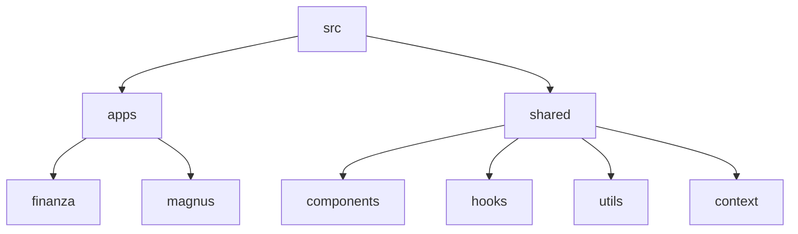

<div align="center">
  <h1>🌌 MagnusOS2</h1>
  <p><strong>Plataforma Integral de Gestión Empresarial, Financiera y Operativa</strong></p>

  
  
  
  
</div>

<hr />

## 📖 Sobre el Proyecto

**MagnusOS2** es un entorno operativo unificado construido para la administración, la gestión financiera avanzada y la integración de inteligencia artificial. Diseñado como un "Sistema Operativo" web, permite a los usuarios alternar entre múltiples módulos interconectados con una experiencia de uso sumamente fluida.

### ✨ Características Principales

* 💰 **Sistema Financiero:** Control de flujo de caja, presupuestos, inversiones, y modelado avanzado de proyecciones (incluyendo simulaciones de Monte Carlo).
* 🤖 **Mentores de IA (Laboratorio):** Integración profunda con modelos de Inteligencia Artificial que fungen como mentores y analistas financieros.
* 🛡️ **Panel Soberano:** Control administrativo total, métricas de hardware, auditoría en tiempo real y seguridad estricta basada en JWT.
* 🌐 **Internacionalización (i18n):** Sistema multi-idiomas listo para usarse.
* 🎨 **UI/UX Moderna:** Diseño inmersivo y responsivo.

---

## 🚀 Requisitos Previos

Asegúrate de tener instalado en tu sistema:
* [Node.js](https://nodejs.org/) v18 o superior.
* [NPM](https://www.npmjs.com/) v9 o superior.

---

## ⚙️ Instalación y Configuración

1. **Clona el repositorio** e ingresa a la carpeta:
   ```bash
   git clone https://github.com/YoxeLaunch/MagnusOS2.git
   cd MagnusOS2
   ```

2. **Instala las dependencias:**
   ```bash
   npm install
   ```

3. **Configura el entorno:**  
   Duplica el archivo `.env.example`, renómbralo a `.env`, y llena los valores necesarios (API Keys, secretos JWT, etc.).

4. **Inicia el servidor en modo desarrollo:**
   ```bash
   npm run dev
   ```
   > 💡 *La plataforma se abrirá localmente con Vite.*

---

## 🛠️ Scripts Disponibles

En el directorio del proyecto, puedes correr:

| Comando | Descripción |
|---------|-------------|
| `npm run dev` | Inicia el entorno de desarrollo en Vite. |
| `npm run build` | Compila y optimiza la aplicación para producción. |
| `npm run preview` | Sirve la carpeta `dist` para probar la versión de producción. |
| `npm run lint` | Analiza el código buscando errores de sintaxis y estilo (ESLint). |
| `npm run type-check` | Verifica los tipos de TypeScript sin compilar. |
| `npm test` | Ejecuta la suite de pruebas unitarias usando Jest. |

---

## 📂 Arquitectura del Proyecto

El sistema está dividido en módulos escalables:



* **`apps/finanza`**: Componentes específicos de gestión monetaria y dashboard de bills.
* **`apps/magnus`**: Funciones del ecosistema OS y el panel de administración.
* **`shared`**: Recursos globales reutilizables en toda la plataforma.

---

## 🤝 Contribuyendo

1. Crea tu propia rama: `git checkout -b feature/MiNuevaIdea`
2. Realiza tus cambios y haz "commit": `git commit -m 'feat: añado una nueva característica'`
3. Sube la rama temporal a GitHub: `git push origin feature/MiNuevaIdea`
4. Abre un **Pull Request** para revisar.

<br>
<div align="center">
  <sub>Construido para el control total ⚜️ — MagnusOS2</sub>
</div>
