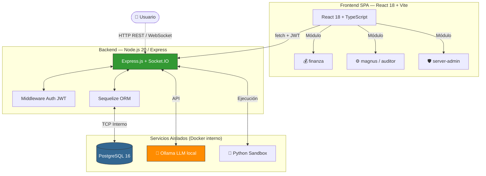
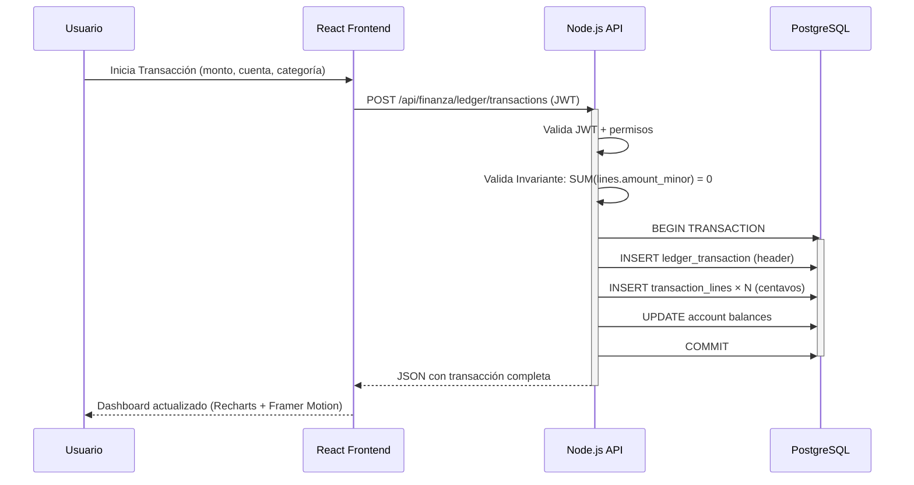

<div align="center">
  <h1>🌌 MagnusOS2</h1>
  <p><strong>Financial Operating System — Plataforma Soberana de Gestión Financiera y Administrativa</strong></p>

  
  
  
  
  
  
</div>

<hr />

## 📖 Sobre el Proyecto

**MagnusOS2** es un **Financial Operating System** personal de uso privado: un entorno operativo web full-stack que funciona como sistema integral de control financiero y administrativo. Registra ingresos, gastos e inversiones; gestiona presupuestos; realiza seguimiento diario de flujo de caja; proyecta balances a fin de mes; administra metas de ahorro; y expone dashboards analíticos en tiempo real.

El nombre "OS2" indica que es la **segunda generación** del sistema (evolución desde `magnus-capital.archived`), con arquitectura rediseñada que incorpora un **ledger de doble entrada** como núcleo contable.

> **Filosofía:** El ledger manda. Toda cifra visible en la UI debe poder reconstruirse desde el libro contable. Los datos nunca salen del servidor propio.

### ✨ Características Principales

| Módulo | Descripción |
|--------|-------------|
| 💰 **Finanzas** | Ledger de doble entrada, flujo de caja, presupuesto, inversiones, metas de ahorro, proyecciones de fin de mes |
| 📊 **Auditor** | Módulo de auditoría contable y reconciliación de cuentas |
| 🤖 **Magnus / Lab IA** | Panel personal, mentores IA, centro de comando, econometría |
| 🛡️ **Panel Soberano** | Control administrativo, métricas de hardware, gestión de usuarios, Docker API |
| 🌐 **Internacionalización** | Sistema multi-idiomas con i18next |
| ⚡ **Tiempo Real** | WebSocket (Socket.IO) para notificaciones y actualizaciones en vivo |
| 🐍 **Sandbox Python** | Contenedor aislado para analítica avanzada y ML (futuro) |
| 🧠 **Ollama IA Local** | LLM hospedado localmente sin envío de datos a terceros |

---

## 🏗️ Arquitectura

MagnusOS2 opera sobre un stack de **4 contenedores Docker** orquestados con un único `docker-compose.yml`:


```mermaid
graph TD
    User(["👤 Usuario"]) -.->|"HTTP REST / WebSocket"| Backend

    subgraph "Frontend SPA — React 18 + Vite"
        React["React 18 + TypeScript"]
        React -->|"Módulo"| Finanzas["💰 finanza"]
        React -->|"Módulo"| Magnus["⚙️ magnus / auditor"]
        React -->|"Módulo"| Admin["🛡️ server-admin"]
    end

    subgraph "Backend — Node.js 20 / Express"
        Backend["Express.js + Socket.IO"]
        JWT["Middleware Auth JWT"]
        ORM["Sequelize ORM"]
        Backend <--> JWT
        Backend <--> ORM
    end

    subgraph "Servicios Aislados (Docker interno)"
        DB[("PostgreSQL 16")]
        AI["🧠 Ollama LLM local"]
        Sandbox["🐍 Python Sandbox"]
    end

    React -->|"fetch + JWT"| Backend
    ORM <-->|"TCP Interno"| DB
    Backend <-->|"API"| AI
    Backend <-->|"Ejecución"| Sandbox

    style Backend fill:#339933,stroke:#333,color:#fff
    style DB fill:#336791,stroke:#333,color:#fff
    style AI fill:#ff8c00,stroke:#333,color:#fff
```

### Stack Tecnológico

| Capa | Tecnología |
|------|------------|
| **Frontend** | React 18 + TypeScript + Vite + TailwindCSS + Recharts + Framer Motion |
| **Backend** | Node.js 20 LTS + Express 4 + Socket.IO + JWT + Helmet + Sequelize 6 |
| **Base de Datos** | PostgreSQL 16 (producción) / SQLite3 (desarrollo) |
| **Infraestructura** | Docker Compose + Nginx + Ubuntu Server 24.04 LTS |
| **IA Local** | Ollama (LLM sin dependencias cloud) + Python Sandbox |
| **Calidad de Código** | TypeScript + Biome + Jest |

---

## 💰 Núcleo Financiero — Ledger de Doble Entrada

El corazón del sistema es un **ledger contable de doble entrada** que garantiza integridad matemática en cada transacción:


```mermaid
sequenceDiagram
    participant U as Usuario
    participant R as React Frontend
    participant E as Node.js API
    participant DB as PostgreSQL

    U->>R: Inicia Transacción (monto, cuenta, categoría)
    R->>E: POST /api/finanza/ledger/transactions (JWT)
    activate E
    E->>E: Valida JWT + permisos
    E->>E: Valida Invariante: SUM(lines.amount_minor) = 0
    E->>DB: BEGIN TRANSACTION
    activate DB
    E->>DB: INSERT ledger_transaction (header)
    E->>DB: INSERT transaction_lines × N (centavos)
    E->>DB: UPDATE account balances
    E->>DB: COMMIT
    deactivate DB
    E-->>R: JSON con transacción completa
    deactivate E
    R-->>U: Dashboard actualizado (Recharts + Framer Motion)
```

**Invariante Contable:**
```javascript
// Validado antes de cada COMMIT — nunca se rompe
SUM(transaction_lines.amount_minor) WHERE transaction_id = X === 0

// Precisión: todos los montos en centavos (BIGINT), sin punto flotante
RD$1,234.56 → almacenado como 123456
```

**Diferencia Conceptual:**
| Operación | Efecto en el Ledger |
|-----------|-------------------|
| **Gasto** | Debita Expenses, Acredita Assets:Cash → reduce patrimonio |
| **Ingreso** | Debita Assets:Cash, Acredita Income → aumenta patrimonio |
| **Inversión** | Debita Assets:Investments, Acredita Assets:Cash → transforma activo (no reduce patrimonio) |
| **Transferencia** | Entre cuentas propias → no afecta cashflow ni patrimonio neto |

---

## 📂 Estructura del Proyecto

```
Magnus-OS2/
├── server/                    # Backend Node.js
│   ├── index.js               # Entry point (Express + Socket.IO)
│   ├── routes/                # 11 archivos de rutas REST
│   │   ├── finanza.routes.js  # Ledger, cuentas, ahorros, import
│   │   ├── auth.routes.js     # Autenticación JWT
│   │   ├── magnus.routes.js   # Dashboard personal + Lab IA
│   │   ├── auditor.routes.js  # Auditoría contable
│   │   ├── econometrics.routes.js # Análisis econométrico
│   │   └── ...
│   ├── controllers/           # Lógica de negocio
│   ├── models/                # Modelos Sequelize (DB schema)
│   ├── middleware/            # JWT auth, rate limiting, security
│   ├── jobs/                  # Cron jobs programados
│   ├── services/              # Docker API, servicios externos
│   └── socket/                # Handlers WebSocket
├── src/                       # Frontend React/TypeScript
│   ├── apps/
│   │   ├── finanza/           # Módulo financiero principal
│   │   ├── magnus/            # Dashboard + Lab IA + Centro Comando
│   │   ├── auditor/           # Auditoría contable
│   │   └── server-admin/      # Panel soberano de administración
│   ├── context/               # React Context providers
│   └── shared/                # Componentes y utils compartidos
├── docker-compose.yml         # Orquestación 4 servicios
├── Dockerfile.api             # Imagen Backend
├── Dockerfile.web             # Imagen Frontend (Nginx)
├── Dockerfile.sandbox         # Imagen Python Sandbox
├── nginx.conf                 # Configuración proxy/static server
├── DOCS.md                    # 📚 Documentación técnica completa
└── package.json               # Dependencias unificadas
```

---

## 🚀 Instalación y Configuración

### Prerequisitos

- [Node.js](https://nodejs.org/) v20 LTS o superior
- [Docker](https://www.docker.com/) + Docker Compose v2
- [NPM](https://www.npmjs.com/) v9 o superior

### Opción A — Desarrollo Local

```bash
# 1. Clonar el repositorio
git clone https://github.com/YoxeLaunch/MagnusOS2.git
cd MagnusOS2

# 2. Instalar dependencias
npm install

# 3. Configurar variables de entorno
cp .env.example .env
# Editar .env con tus valores (JWT_SECRET, etc.)

# 4. Iniciar en modo desarrollo (Frontend + Backend)
npm run start:all
```

> 💡 El frontend abre en Vite (HMR activo) y el backend en `localhost:4000`

### Opción B — Docker (Producción)

```bash
# 1. Configurar entorno
cp .env.example .env
# Editar .env con tus valores

# 2. Construir y levantar todos los servicios
docker compose up -d --build

# 3. Ver estado y logs
docker compose ps
docker compose logs -f
```

---

## 🛠️ Scripts Disponibles

| Comando | Descripción |
|---------|-------------|
| `npm run dev` | Frontend en Vite (HMR) |
| `npm run server` | Backend en Node.js (puerto 4000) |
| `npm run start:all` | Frontend + Backend en paralelo |
| `npm run build` | Compila frontend para producción |
| `npm run preview` | Sirve `dist/` para probar producción |
| `npm run lint` | Analiza y auto-corrige código (Biome) |
| `npm run format` | Formatea código (Biome) |
| `npm run analyze` | lint + type-check en un paso |
| `npm run type-check` | Verifica tipos TypeScript |
| `npm test` | Suite de pruebas (Jest) |
| `npm run mcp` | Inicia servidor MCP (Model Context Protocol) |

---

## 📊 KPIs Financieros del Sistema

El módulo de análisis calcula **5 métricas clave** de salud financiera:

| KPI | Fórmula | Descripción |
|-----|---------|-------------|
| **Tasa de Ahorro** | `(Ingresos - Gastos) / Ingresos × 100` | % de ingresos que se retienen como capital |
| **Disciplina Financiera** | `Días con registro / 90 × 100` | Consistencia de registro en 90 días |
| **Adherencia al Plan** | `Meses positivos / Total meses × 100` | Sostenibilidad del estilo de vida |
| **Cash Runway** | `Ahorros / Gasto Mensual Promedio` | Meses de autonomía si ingresos = 0 |
| **Estabilidad de Gastos** | `100 - (σ / μ × 100)` | Predictibilidad del gasto (baja volatilidad) |

El algoritmo de predicción evoluciona automáticamente:
- **< 3 meses de datos:** Promedio simple
- **≥ 3 meses:** Regresión lineal por mínimos cuadrados

---

## 🐳 Infraestructura Docker

El sistema opera con **4 contenedores Docker** optimizados para servidores con 8GB de RAM:

| Servicio | Imagen | RAM estimada | Propósito |
|----------|--------|-------------|-----------|
| `postgres` | postgres:16-alpine | 150-300MB | Base de datos principal |
| `magnus` | magnus-api:latest | 120-200MB | Backend + Frontend servido |
| `ollama` | ollama/ollama | 2-6GB* | LLM local (IA) |
| `sandbox` | python:sandbox | 50-100MB | Analítica Python aislada |

> *Ollama: usar modelos Q4_K_M y `OLLAMA_MAX_LOADED_MODELS=1` para optimizar RAM.

PostgreSQL está configurado con parámetros optimizados para hardware doméstico (`shared_buffers=256MB`, `max_connections=50`, `synchronous_commit=off`).

---

## 🔒 Seguridad

El sistema implementa múltiples capas de seguridad:

- ✅ **JWT** en todas las rutas financieras (sin excepción)
- ✅ **Helmet** — headers HTTP de seguridad (CSP, HSTS, etc.)
- ✅ **Rate Limiting** — express-rate-limit en todas las rutas
- ✅ **PostgreSQL aislado** — puerto NO expuesto al exterior
- ✅ **Payload limits** — 1MB general, 10MB para importaciones
- ✅ **CORS** restringido al dominio del frontend
- ✅ **Secrets en `.env`** — nunca en el repositorio

---

## 📋 Roadmap

### Corto Plazo (1–3 meses)
- [ ] Dashboard unificado legacy + ledger
- [ ] Suavizado exponencial en predicciones
- [ ] Alertas Telegram automáticas
- [ ] Backup automático diario configurado

### Mediano Plazo (3–9 meses)
- [ ] Vista materializada PostgreSQL (-80% tiempo query)
- [ ] Redis cache para dashboard
- [ ] Categorización automática via ML
- [ ] Importación CSV bancos dominicanos (BHD, Popular, BanReservas)

### Largo Plazo (9–24 meses)
- [ ] AI Analyst con acceso real al ledger (Ollama local)
- [ ] Forecasting ARIMA en Python Sandbox
- [ ] Módulo de impuestos DOP (ISR, AFP, SFS)
- [ ] App móvil PWA instalable

---

## 📚 Documentación

Toda la documentación técnica está consolidada en un único archivo:

- **[DOCS.md](DOCS.md)** — Documentación técnica completa:
  - Comandos y operación detallada
  - Arquitectura y flujos de datos
  - Modelos de datos completos (SQL)
  - API endpoints documentados
  - Guía de KPIs y algoritmos financieros
  - Plan de fases de implementación
  - Seguridad y backups
  - Roadmap y mejoras propuestas

---

## 🤝 Contribuyendo

1. Haz un **Fork** del repositorio
2. Crea tu rama: `git checkout -b feature/MiNuevaIdea`
3. Commit con descripción clara: `git commit -m 'feat: descripción'`
4. Sube los cambios: `git push origin feature/MiNuevaIdea`
5. Abre un **Pull Request**

---

## ✒️ Autor y Créditos

Este Financial OS fue creado e ideado por:
* **YoxeLaunch** — Arquitecto, Desarrollador Principal y Creador Original
* GitHub: [@YoxeLaunch](https://github.com/YoxeLaunch)

<br />
<div align="center">
  <p><strong>Construido para el control total ⚜️ — Diseñado por YoxeLaunch</strong></p>
  <sub>© 2026 MagnusOS2 Project · Self-hosted · Sovereign by design</sub>
</div>
