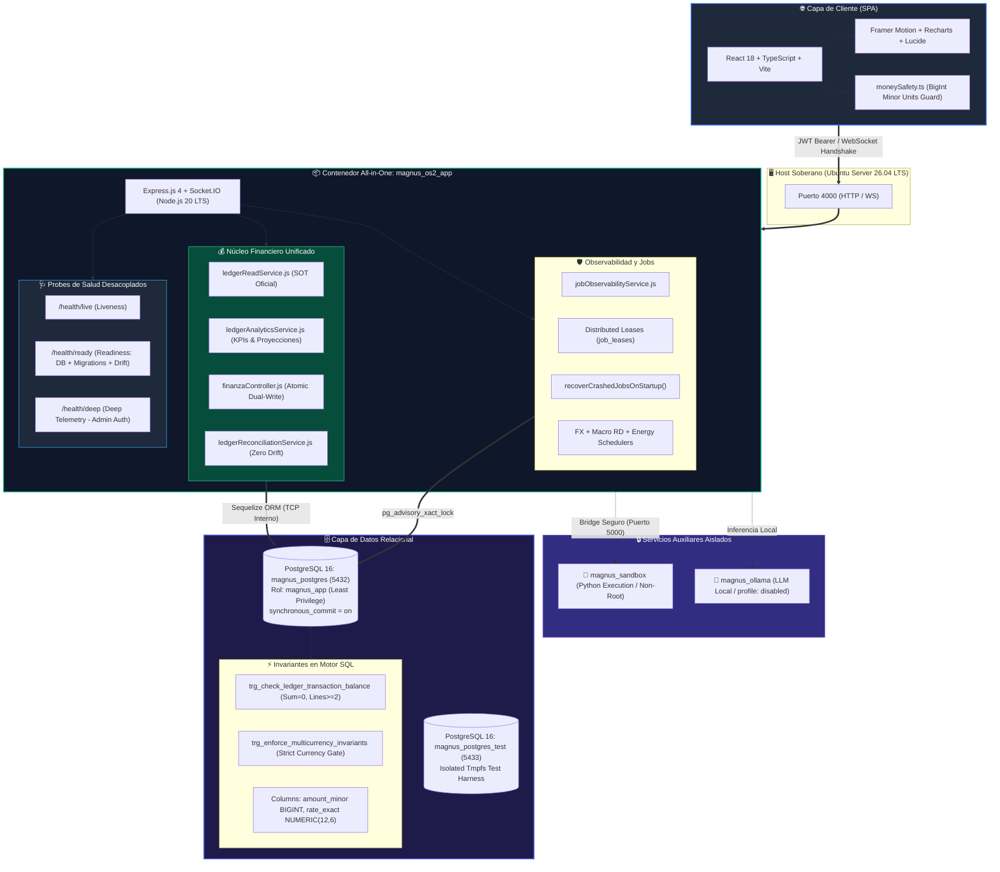
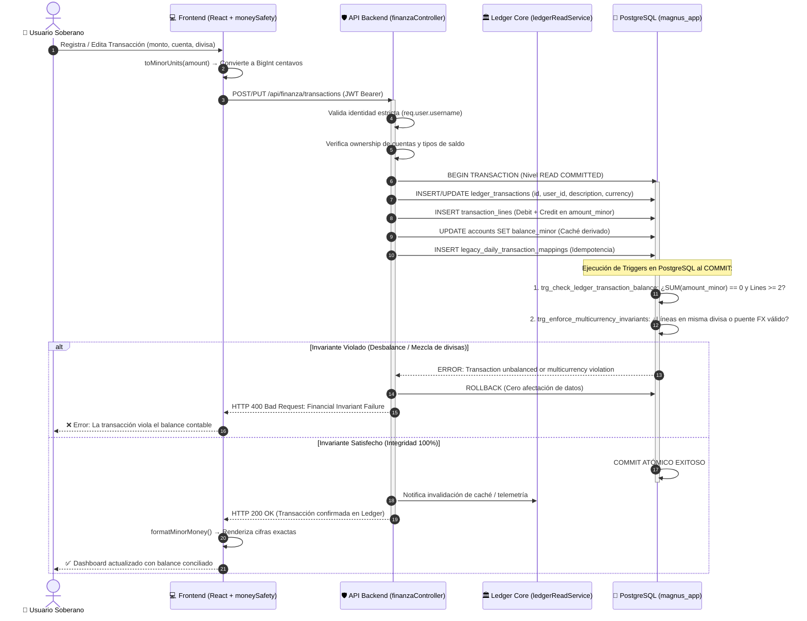
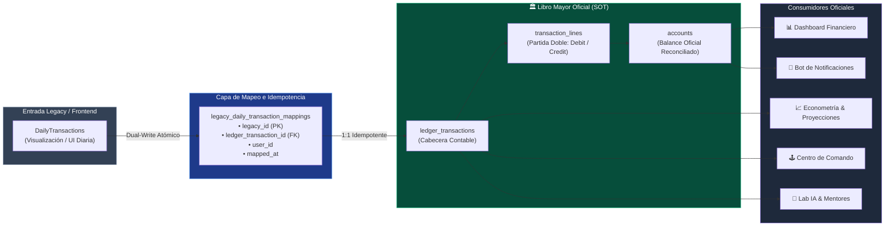
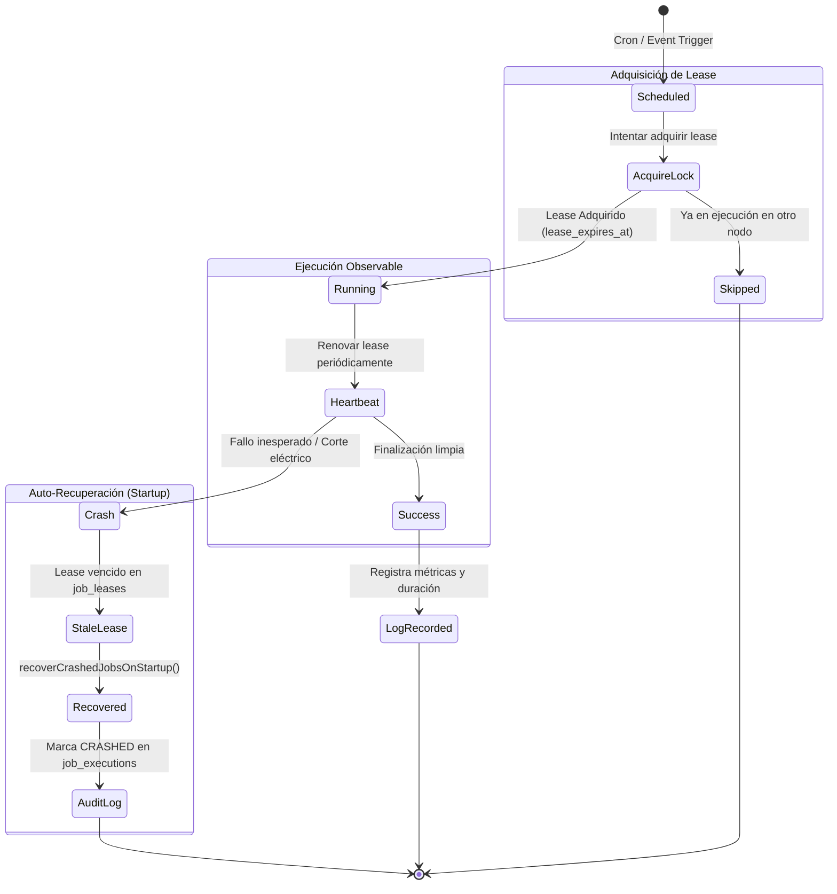

<div align="center">
  <h1>🌌 MagnusOS2</h1>
  <p><strong>Financial Operating System — Plataforma Soberana de Gestión Financiera y Administrativa</strong></p>

  
  
  
  
  
  
  
  <br />
  
  
  
  
  
  
</div>

<hr />

## 📖 Sobre el Proyecto

**MagnusOS2** es un **Financial Operating System** personal de grado institucional y uso privado: un entorno operativo web full-stack diseñado para el control soberano de finanzas, administración de patrimonio e inteligencia de mercado.

El sistema opera bajo un principio inquebrantable: **el Ledger contable de doble entrada es la única fuente oficial de verdad financiera**. Toda cifra proyectada, balance de cuenta o métrica patrimonial se calcula o reconcilia matemáticamente contra el libro mayor, con integridad garantizada a nivel relacional en PostgreSQL y almacenamiento monetario exacto en unidades enteras menores (`BigInt` / centavos).

> 🏛️ **Filosofía Soberana:** El dato nunca abandona la infraestructura propia. Todo reside en la red soberana privada (**Providence Local Network**), con durabilidad transaccional estricta, aislamiento multiusuario hermético y sin telemetría de terceros.
>
> 🛡️ **Clasificación de Seguridad & Resiliencia:** `[PRODUCCIÓN / HARDENED / PHASE II VALIDATED]`  
> 📑 **Informe Final de Remediación (Fase II):** [`docs/audit/PHASE2_FINAL_REMEDIATION_REPORT.md`](docs/audit/PHASE2_FINAL_REMEDIATION_REPORT.md)  
> 🗺️ **Mapa de Fuente de Verdad Financiera:** [`docs/PHASE2_FINAL_SOURCE_OF_TRUTH_MAP.md`](docs/PHASE2_FINAL_SOURCE_OF_TRUTH_MAP.md)  
> 📘 **Manual de Despliegue en Producción:** [`docs/PHASE2_FINAL_PRODUCTION_RUNBOOK.md`](docs/PHASE2_FINAL_PRODUCTION_RUNBOOK.md)  
> 📂 **Archivo de Auditorías & Revisiones:** [`docs/audit/`](docs/audit/)

---

## 🏛️ Topología y Arquitectura del Sistema

MagnusOS2 opera mediante una arquitectura multicapa orquestada en Docker Compose, diseñada para alta disponibilidad, observabilidad y mínimo consumo de recursos:


```mermaid
graph TB
    subgraph Client ["🌐 Capa de Cliente (SPA)"]
        UI["React 18 + TypeScript + Vite"]
        Framer["Framer Motion + Recharts + Lucide"]
        Safety["moneySafety.ts (BigInt Minor Units Guard)"]
        UI --- Framer
        UI --- Safety
    end

    subgraph Host ["🖥️ Host Soberano (Ubuntu Server 26.04 LTS)"]
        Proxy["Puerto 4000 (HTTP / WS)"]
    end

    subgraph AppContainer ["📦 Contenedor All-in-One: magnus_os2_app"]
        direction TB
        Server["Express.js 4 + Socket.IO (Node.js 20 LTS)"]
        
        subgraph Probes ["🩺 Probes de Salud Desacoplados"]
            Live["/health/live (Liveness)"]
            Ready["/health/ready (Readiness: DB + Migrations + Drift)"]
            Deep["/health/deep (Deep Telemetry - Admin Auth)"]
        end

        subgraph CoreEngine ["💰 Núcleo Financiero Unificado"]
            LedgerService["ledgerReadService.js (SOT Oficial)"]
            AnalyticsService["ledgerAnalyticsService.js (KPIs & Proyecciones)"]
            DualWrite["finanzaController.js (Atomic Dual-Write)"]
            Reconciler["ledgerReconciliationService.js (Zero Drift)"]
        end

        subgraph Resilience ["🛡️ Observabilidad y Jobs"]
            JobEngine["jobObservabilityService.js"]
            LeaseLock["Distributed Leases (job_leases)"]
            CrashRecovery["recoverCrashedJobsOnStartup()"]
            Schedulers["FX + Macro RD + Energy Schedulers"]
        end

        Server --> Probes
        Server --> CoreEngine
        Server --> Resilience
    end

    subgraph DatabaseCluster ["🗄️ Capa de Datos Relacional"]
        ProdDB[("PostgreSQL 16: magnus_postgres (5432)<br/>Rol: magnus_app (Least Privilege)<br/>synchronous_commit = on")]
        TestDB[("PostgreSQL 16: magnus_postgres_test (5433)<br/>Isolated Tmpfs Test Harness")]
        
        subgraph Constraints ["⚡ Invariantes en Motor SQL"]
            TrigBalance["trg_check_ledger_transaction_balance (Sum=0, Lines>=2)"]
            TrigCurrency["trg_enforce_multicurrency_invariants (Strict Currency Gate)"]
            ExactColumns["Columns: amount_minor BIGINT, rate_exact NUMERIC(12,6)"]
        end

        ProdDB --- Constraints
    end

    subgraph IsolatedServices ["🔒 Servicios Auxiliares Aislados"]
        Sandbox["🐍 magnus_sandbox (Python Execution / Non-Root)"]
        Ollama["🧠 magnus_ollama (LLM Local / profile: disabled)"]
    end

    Client ==>|"JWT Bearer / WebSocket Handshake"| Proxy
    Proxy ==> AppContainer
    CoreEngine ==>|"Sequelize ORM (TCP Interno)"| ProdDB
    Resilience ==>|"pg_advisory_xact_lock"| ProdDB
    AppContainer -.->|"Bridge Seguro (Puerto 5000)"| Sandbox
    AppContainer -.->|"Inferencia Local"| Ollama

    style Client fill:#1e293b,stroke:#3b82f6,stroke-width:2px,color:#fff
    style AppContainer fill:#0f172a,stroke:#10b981,stroke-width:2px,color:#fff
    style DatabaseCluster fill:#1e1b4b,stroke:#6366f1,stroke-width:2px,color:#fff
    style IsolatedServices fill:#312e81,stroke:#8b5cf6,stroke-width:1px,color:#fff
    style CoreEngine fill:#064e3b,stroke:#34d399,stroke-width:1px,color:#fff
    style Probes fill:#1e293b,stroke:#38bdf8,stroke-width:1px,color:#fff
```

---

## 💰 Núcleo Financiero — Ciclo de Vida del Ledger de Doble Entrada

El Ledger de doble entrada es inmutable. Cada transacción financiera (ingreso, gasto, transferencia, ajuste) se procesa de forma atómica y debe cumplir estrictamente la regla matemática de suma cero por divisa:


```mermaid
sequenceDiagram
    autonumber
    actor User as 👤 Usuario Soberano
    participant UI as 💻 Frontend (React + moneySafety)
    participant API as 🛡️ API Backend (finanzaController)
    participant SOT as 🏛️ Ledger Core (ledgerReadService)
    participant DB as 🐘 PostgreSQL (magnus_app)

    User->>UI: Registra / Edita Transacción (monto, cuenta, divisa)
    UI->>UI: toMinorUnits(amount) → Convierte a BigInt centavos
    UI->>API: POST/PUT /api/finanza/transactions (JWT Bearer)
    activate API
    API->>API: Valida identidad estricta (req.user.username)
    API->>API: Verifica ownership de cuentas y tipos de saldo
    API->>DB: BEGIN TRANSACTION (Nivel READ COMMITTED)
    activate DB
    API->>DB: INSERT/UPDATE ledger_transactions (id, user_id, description, currency)
    API->>DB: INSERT transaction_lines (Debit + Credit en amount_minor)
    API->>DB: UPDATE accounts SET balance_minor (Caché derivado)
    API->>DB: INSERT legacy_daily_transaction_mappings (Idempotencia)
    Note over DB: Ejecución de Triggers en PostgreSQL al COMMIT:
    DB->>DB: 1. trg_check_ledger_transaction_balance: ¿SUM(amount_minor) == 0 y Lines >= 2?
    DB->>DB: 2. trg_enforce_multicurrency_invariants: ¿Líneas en misma divisa o puente FX válido?
    alt Invariante Violado (Desbalance / Mezcla de divisas)
        DB-->>API: ERROR: Transaction unbalanced or multicurrency violation
        API->>DB: ROLLBACK (Cero afectación de datos)
        API-->>UI: HTTP 400 Bad Request: Financial Invariant Failure
        UI-->>User: ❌ Error: La transacción viola el balance contable
    else Invariante Satisfecho (Integridad 100%)
        DB->>DB: COMMIT ATÓMICO EXITOSO
        deactivate DB
        API->>SOT: Notifica invalidación de caché / telemetría
        API-->>UI: HTTP 200 OK (Transacción confirmada en Ledger)
        deactivate API
        UI->>UI: formatMinorMoney() → Renderiza cifras exactas
        UI-->>User: ✅ Dashboard actualizado con balance conciliado
    end
```

### Invariantes Contables Garantizados en PostgreSQL

1. **Suma Cero Estricta:**
   ```sql
   -- Evaluado por trg_check_ledger_transaction_balance en COMMIT:
   SUM(transaction_lines.amount_minor) WHERE transaction_id = X = 0 AND COUNT(*) >= 2;
   ```
2. **Invariante Multimoneda:**
   ```sql
   -- Evaluado por trg_enforce_multicurrency_invariants:
   -- Todas las líneas deben compartir la divisa del encabezado, salvo operaciones con puente FX explícito.
   ```
3. **Almacenamiento Monetario Exacto:**
   - **Montos:** `amount_minor BIGINT` (centavos, sin imprecisión IEEE 754 de punto flotante).
   - **Tipos de Cambio:** `rate_exact NUMERIC(12, 6)` (precisión cambiaria institucional a 6 decimales).

---

## 🔄 Arquitectura de Cutover y Convivencia Legacy

Para garantizar la compatibilidad con interfaces históricas sin fragmentar la contabilidad, MagnusOS2 utiliza un patrón de fachada con mapeo determinista hacia el Ledger:


```mermaid
flowchart LR
    subgraph LegacyEntry ["Entrada Legacy / Frontend"]
        DT["DailyTransactions<br/>(Visualización / UI Diaria)"]
    end

    subgraph MappingLayer ["Capa de Mapeo e Idempotencia"]
        Map["legacy_daily_transaction_mappings<br/>• legacy_id (PK)<br/>• ledger_transaction_id (FK)<br/>• user_id<br/>• mapped_at"]
    end

    subgraph LedgerOfficial ["🏛️ Libro Mayor Oficial (SOT)"]
        LT["ledger_transactions<br/>(Cabecera Contable)"]
        TL["transaction_lines<br/>(Partida Doble: Debit / Credit)"]
        ACC["accounts<br/>(Balance Oficial Reconciliado)"]
        LT --> TL
        TL --> ACC
    end

    DT -->|"Dual-Write Atómico"| Map
    Map -->|"1:1 Idempotente"| LT

    subgraph ConsumerServices ["Consumidores Oficiales"]
        Dashboard["📊 Dashboard Financiero"]
        Econometrics["📈 Econometría & Proyecciones"]
        Command["🕹️ Centro de Comando"]
        AI["🤖 Lab IA & Mentores"]
        Telegram["📱 Bot de Notificaciones"]
    end

    ACC --> Dashboard
    LT --> Econometrics
    LT --> Command
    LT --> AI
    ACC --> Telegram

    style LegacyEntry fill:#334155,stroke:#94a3b8,color:#fff
    style MappingLayer fill:#1e3a8a,stroke:#60a5fa,color:#fff
    style LedgerOfficial fill:#064e3b,stroke:#34d399,color:#fff
    style ConsumerServices fill:#1e293b,stroke:#a78bfa,color:#fff
```

- **Cutover Ejecutado en Producción:** **433 de 433 transacciones legacy migradas** exitosamente al Ledger oficial sin pérdida de datos.
- **Reconciliación Contable:** **3 de 3 cuentas reconciliadas con 0 discrepancias (`Status: HEALTHY`)**.

---

## ⏱️ Observabilidad y Auto-Recuperación de Procesos (Jobs)

Los procesos en segundo plano (sincronizadores de tasas cambiarias BCRD, indicadores macroeconómicos y snapshots mensuales) están protegidos mediante **leases distribuidos** y **recuperación automática de caídas**:


```mermaid
stateDiagram-v2
    [*] --> Scheduled: Cron / Event Trigger

    state "Adquisición de Lease" as LeaseAcquisition {
        Scheduled --> AcquireLock: Intentar adquirir lease
        AcquireLock --> Running: Lease Adquirido (lease_expires_at)
        AcquireLock --> Skipped: Ya en ejecución en otro nodo
    }

    state "Ejecución Observable" as Execution {
        Running --> Heartbeat: Renovar lease periódicamente
        Heartbeat --> Success: Finalización limpia
        Heartbeat --> Crash: Fallo inesperado / Corte eléctrico
    }

    state "Auto-Recuperación (Startup)" as Recovery {
        Crash --> StaleLease: Lease vencido en job_leases
        StaleLease --> Recovered: recoverCrashedJobsOnStartup()
        Recovered --> AuditLog: Marca CRASHED en job_executions
    }

    Success --> LogRecorded: Registra métricas y duración
    AuditLog --> [*]
    LogRecorded --> [*]
    Skipped --> [*]
```

- **Tabla de Leases:** `job_leases` previene concurrencia no deseada entre múltiples instancias.
- **Auditoría de Ejecución:** `job_executions` registra tiempos de inicio, fin, estado (`RUNNING`, `SUCCESS`, `CRASHED`), duración y telemetría de errores.
- **Recuperación en Arranque:** Al iniciar el servidor, `recoverCrashedJobsOnStartup()` identifica leases huérfanos por cortes abruptos de energía y los clasifica como `CRASHED` sin dejar bloqueado el sistema.

---

## 🛡️ Matriz de Remediación y Hardening (Fase II)

| Dimensión | Auditoría Inicial | Estado Final Producción | Garantía y Evidencia |
|---|:---:|:---:|---|
| **Núcleo Contable** | ⚠️ Fragmentado | 🟢 **Ledger Único Oficial** | Todos los consumidores financieros leen exclusivamente de `ledgerReadService.js` / `ledgerAnalyticsService.js`. |
| **Invariante Multimoneda** | 🔴 Inexistente | 🟢 **Triggers Activos** | Triggers en PostgreSQL impiden mezclar divisas en una transacción sin puente FX explícito. |
| **Precisión Numérica** | ⚠️ Floats en UI/API | 🟢 **Exact Money (BigInt)** | Unidades menores enteras (`amount_minor`) en BD, API y componentes React (`moneySafety.ts`). |
| **Dual-Write Legacy** | 🔴 Divergente | 🟢 **Atómico (SQL Tx)** | Edición legacy actualiza cabecera, líneas contables y saldo de cuenta en la misma transacción SQL. |
| **Gobernanza de Schema** | ⚠️ Drift Potencial | 🟢 **Zero Drift (`isSynced`)** | 11 migraciones reproducibles (000–010) protegidas por `pg_advisory_xact_lock`. |
| **Observabilidad de Jobs** | 🔴 Inexistente | 🟢 **Leases + Telemetría** | Leases distribuidos (`job_leases`), logging estructurado y recuperación automática ante crashes. |
| **Probes Operativos** | 🔴 Acoplados a JWT | 🟢 **Desacoplados** | `/health/live` y `/health/ready` públicos para orquestadores; `/health/deep` protegido para telemetría admin. |
| **Simulacro de Restore** | 🔴 No probado | 🟢 **Verificado (Drill OK)** | `npm run db:restore:drill` valida backup físico y consistencia relacional periódica. |
| **Pruebas Automatizadas** | ⚠️ Parciales (42) | 🟢 **159/159 Passing (100%)** | 57 pruebas unitarias Jest + 102 pruebas de integración en PostgreSQL aislado (`test:postgres`). |

---

## 🚀 Puesta en Marcha y Verificación

### Prerrequisitos

- [Ubuntu Server](https://ubuntu.com/) v26.04 LTS o superior
- [Docker](https://www.docker.com/) v29.1+ & Docker Compose v2.40+
- [Node.js](https://nodejs.org/) v20 LTS (v20.20+)
- [PostgreSQL Client](https://www.postgresql.org/) v16 (`pg_dump` / `pg_restore`)

### Ejecución de Pruebas (100% Aisladas)

MagnusOS2 cuenta con un arnés de pruebas estricto que **nunca toca la base de datos de producción**:

```bash
# 1. Ejecutar tests unitarios (Jest en memoria)
npm test

# 2. Ejecutar tests de integración sobre PostgreSQL aislado (puerto 5433)
npm run test:postgres

# 3. Validar compilación de producción del frontend
npm run build

# 4. Validar estado de gobernanza de migraciones
docker compose run --rm --no-deps magnus node scripts/migrate.js status

# 5. Ejecutar simulacro completo de respaldo y restauración
npm run db:restore:drill
```

### Comprobación de Salud en Producción (Live Probes)

```bash
# Liveness Probe (¿El servidor responde?)
curl -i http://127.0.0.1:4000/health/live
# HTTP/1.1 200 OK -> {"status":"UP","uptimeSeconds":32,"version":"2.0.0"}

# Readiness Probe (¿Base de datos lista, migraciones al día y cero drift?)
curl -i http://127.0.0.1:4000/health/ready
# HTTP/1.1 200 OK -> {"status":"READY","checks":{"database":true,"migrations":true,"schemaDrift":true}}

# Reconciliación Contable en Vivo
docker compose run --rm --no-deps magnus node scripts/reconcile-ledger.js
# Output: Status: HEALTHY | Discrepancies: 0 | Security Leaks: 0
```

---

## 📂 Estructura del Repositorio

```
MagnusOS2/
├── server/                         # Backend Institucional Node.js 20 LTS
│   ├── config/database.js          # Configuración de conexiones PostgreSQL / SQLite
│   ├── controllers/                # Controladores de dominio (finanzas, auth, mercado)
│   ├── middleware/                 # JWT estricto, rate limiting, security headers Helmet
│   ├── migrations/                 # Migraciones relacionales ordenadas (000_ a 010_)
│   ├── models/                     # Modelos Sequelize 6 (Ledger, Cuentas, Mercados, Jobs)
│   ├── routes/                     # Rutas modulares REST y health probes desacoplados
│   ├── services/                   # SOT Financiero, Observabilidad, Gobernanza y Reconciliador
│   │   ├── ledgerReadService.js    # Lógica oficial de consulta del libro mayor
│   │   ├── ledgerAnalyticsService.js # Agregación contable y métricas sin mezcla de divisas
│   │   ├── jobObservabilityService.js# Leases distribuidos y ciclo de vida de jobs
│   │   ├── migrationRunner.js      # Ejecutor transaccional con advisory locks
│   │   └── schemaDriftService.js   # Verificador de paridad Sequelize vs PostgreSQL
│   └── socket/                     # Handlers WebSocket autenticados en tiempo real
├── src/                            # Frontend React 18 + TypeScript + Vite
│   ├── apps/
│   │   ├── finanza/                # Módulo Financiero (Ledger, CashFlow, Providence FX)
│   │   │   ├── pages/              # Ledger, Cuentas, Ahorros, Patrimonio, Proyecciones
│   │   │   └── utils/moneySafety.ts# Blindaje numérico BigInt contra errores de redondeo
│   │   ├── magnus/                 # Sabiduría, Pensum, Lab IA y Centro de Comando
│   │   └── server-admin/           # Torre de Control Soberana (HUD, Hardware, Logs)
│   └── shared/                     # Componentes y contextos compartidos
├── scripts/                        # Automatizaciones de infraestructura
│   ├── cutover-daily-transactions.js # Migrador idempotente de transacciones legacy
│   ├── reconcile-ledger.js         # Auditor de integridad de saldos en tiempo real
│   ├── migrate.js                  # CLI de migraciones y baselines
│   ├── schema-drift.js             # Auditor de discrepancias de esquema
│   └── restore-drill.js            # Simulacro de restauración de backups en sandbox
├── docs/                           # Documentación de ingeniería y gobernanza
│   ├── PHASE2_FINAL_SOURCE_OF_TRUTH_MAP.md # Matriz de fuentes de verdad
│   ├── PHASE2_FINAL_PRODUCTION_RUNBOOK.md  # Runbook paso a paso para despliegues
│   └── PHASE2_DEPENDENCIES_AUDIT_REPORT.md # Auditoría de dependencias y riesgos
├── docker-compose.yml              # Orquestación de servicios en red soberana
├── Dockerfile.api                  # Imagen multicapa optimizada para producción
└── package.json                    # Dependencias y scripts de prueba
```

---

## 🔒 Seguridad y Principio de Menor Privilegio

- **Identidad Inmutable:** La identidad del usuario se deriva estrictamente del payload criptográfico del token JWT verificado en backend (`req.user.username` / `socket.user.username`). No se aceptan parámetros de suplantación en `body`, `query` o `params`.
- **Menor Privilegio en Base de Datos:** La aplicación se conecta mediante el usuario dedicado `magnus_app` (`NOSUPERUSER`, `NOCREATEDB`, `NOCREATEROLE`, `NOBYPASSRLS`), garantizando que una vulnerabilidad a nivel de aplicación no comprometa el motor de PostgreSQL.
- **Durabilidad Máxima:** `synchronous_commit = on` activado permanentemente en PostgreSQL para garantizar que toda transacción confirmada esté escrita en disco ante cualquier corte abrupto de energía.
- **Python Sandbox Enjaulado:** Contenedor no-root (`sandboxuser`, UID 1000) con límites de CPU (1.0), memoria (512MB), archivos temporales únicos con UUID y timeout forzoso de 20s.

---

## ✒️ Autor y Créditos

Este Financial Operating System fue conceptualizado, diseñado y desarrollado por:

* **YoxeLaunch** — Creador Original, Arquitecto de Software y Desarrollador Principal  
* GitHub: [@YoxeLaunch](https://github.com/YoxeLaunch)

<br />
<div align="center">
  <p><strong>Construido para la Soberanía Financiera y el Control Total ⚜️ — Diseñado por YoxeLaunch</strong></p>
  <sub>© 2026 MagnusOS2 Project · Self-hosted · Sovereign by design</sub>
</div>
