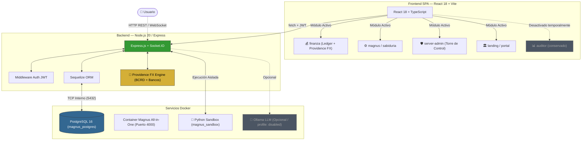
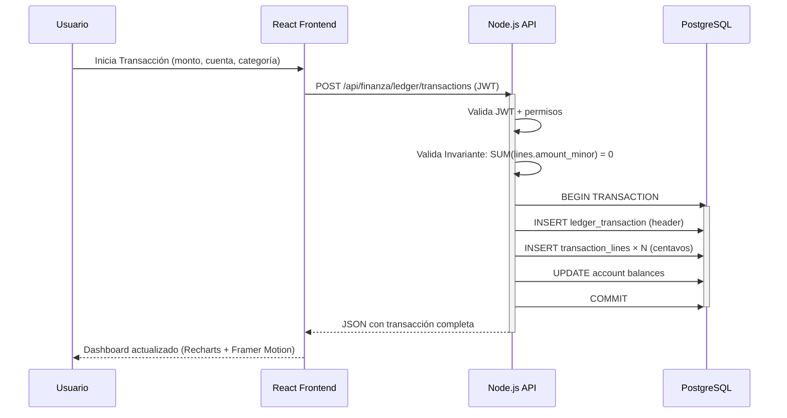

<div align="center">
  <h1>🌌 MagnusOS2</h1>
  <p><strong>Financial Operating System — Plataforma Soberana de Gestión Financiera y Administrativa</strong></p>

  
  
  
  
  
  
</div>

<hr />

## 📖 Sobre el Proyecto

**MagnusOS2** es un **Financial Operating System** personal de uso privado: un entorno operativo web full-stack que funciona como sistema integral de control financiero y administrativo. Registra ingresos, gastos e inversiones; gestiona presupuestos; realiza seguimiento diario de flujo de caja; proyecta balances a fin de mes; administra metas de ahorro; monitorea cotizaciones de mercado cambiario en tiempo real; y expone dashboards analíticos en vivo.

El nombre "OS2" indica que es la **segunda generación** del sistema (evolución desde `magnus-capital.archived`), con arquitectura rediseñada que incorpora un **ledger de doble entrada** como núcleo contable inmutable.

> **Filosofía:** El ledger manda. Toda cifra visible en la UI debe poder reconstruirse desde el libro contable. Los datos nunca salen del servidor propio y residen en red privada soberana (**Providence Local Network**).

---

### ✨ Características Principales

| Módulo | Estado | Descripción |
|--------|:------:|-------------|
| 💰 **Finanzas & Ledger** | 🟢 **Activo** | Ledger contable de doble entrada, flujo de caja, presupuesto, inversiones, metas de ahorro y proyecciones de fin de mes. |
| 💱 **Providence FX & Mercado** | 🟢 **Activo** | Inteligencia de mercado en vivo (`/finanza/mercado`), cotizaciones bancarias en tiempo real para **USD/DOP** y **EUR/DOP**, referencias oficiales del Banco Central (BCRD), Yahoo Finance, comparador de arbitraje bancario, conversor cruzado y gráficos históricos. |
| 🔐 **Acceso Providence 2.0** | 🟢 **Activo** | Portal de autenticación moderno con diseño arquitectónico nocturno en alta definición, pestañas unificadas de Iniciar Sesión / Registro, tarjetas de capacidades y resguardo de la versión clásica. |
| 🤖 **Magnus / Lab IA** | 🟢 **Activo** | Panel personal de productividad, mentores estratégicos, pensum/currículum, centro de comando y análisis econométrico. |
| 📰 **Publicaciones** | 🟢 **Activo** | Blog interno de Mentoría y Estrategia: el soberano publica artículos con imágenes de portada y adjuntos (PDFs hasta 15MB); lectura optimizada para usuarios. |
| 🛡️ **Panel Soberano (Torre de Control)** | 🟢 **Activo** | Consola de administración con sidebar (Usuarios, Mentores, Pensum, Economía, Sistema, Backups, Comms, Novedades/Changelog), métricas de hardware y Docker API. |
| 📢 **Changelog en Base de Datos** | 🟢 **Activo** | Historial de Novedades persistido en PostgreSQL (`SystemUpdates`) expuesto en el modal interactivo de bienvenida (`WelcomeIntro`). |
| 🌐 **Internacionalización** | 🟢 **Activo** | Sistema multi-idiomas nativo con i18next (Español / Inglés). |
| ⚡ **Tiempo Real** | 🟢 **Activo** | Canales WebSocket (Socket.IO) para telemetría, notificaciones y eventos en vivo. |
| 📊 **Auditor Contable** | 🟡 *Inactivo* | Módulo de auditoría y reconciliación contable — *temporalmente deshabilitado en menús y rutas para simplificar el flujo, código 100% conservado en `src/apps/auditor` para reactivación inmediata*. |
| 🧠 **Ollama IA Local** | 🟡 *Opcional* | LLM hospedado localmente — *desactivado por defecto vía Docker profile (`profiles: ["disabled"]`) para optimizar memoria RAM del host (8GB)*. |
| 🐍 **Sandbox Python** | 🟢 **Aislado** | Contenedor auxiliar de entorno seguro para scripts de analítica avanzada y futuros modelos de pronóstico. |

---

### 🆕 Actualizaciones Recientes

- **Acceso Providence 2.0 & Archivo Histórico:** Rediseño arquitectónico integral de la pantalla de bienvenida con estética nocturna panorámica de la sede Providence, pestañas unificadas de inicio de sesión / alta de cuenta, tarjetas interactivas de capacidades (Finanzas, Datos, Planificación y Seguridad) y archivado seguro del login clásico en `src/shared/components/auth/archive/`.
- **Providence FX Multi-Moneda (USD & EUR / DOP):** Motor institucional de inteligencia cambiaria en `/finanza/mercado`. Monitorea en tiempo real más de 20 bancos de República Dominicana y referencias oficiales del Banco Central (BCRD) para Dólar y Euro, comparador de arbitraje (mejores tasas de compra/venta), spread cambiario y conversor bidireccional inteligente.
- **Mercado Financiero en Vivo & Gráficos:** Módulo de telemetría de activos con cotizaciones globales, índices bursátiles, materias primas, criptomonedas y gráficos técnicos interactivos.
- **Gestión de Novedades Centralizada:** Sistema de changelog en base de datos PostgreSQL (`SystemUpdates`) accesible desde el modal de bienvenida y el panel soberano.
- **Aislamiento de Recursos (Ollama & Auditor):** Configuración de Ollama como servicio opcional (`profiles: ["disabled"]`) y resguardo del módulo de auditoría sin carga innecesaria en la navegación.
- **Fix de Impresión Financiera:** Reporte financiero PDF depurado para respetar vigencias reales de contratos (`validFrom`/`validTo`) evitando sumas erróneas de salarios anteriores.

---

## 🏗️ Arquitectura

MagnusOS2 opera sobre una infraestructura optimizada orquestada mediante Docker Compose:


```mermaid
graph TD
    User(["👤 Usuario"]) -.->|"HTTP REST / WebSocket"| Backend

    subgraph "Frontend SPA — React 18 + Vite"
        React["React 18 + TypeScript"]
        React -->|"Módulo Activo"| Finanzas["💰 finanza (Ledger + Providence FX)"]
        React -->|"Módulo Activo"| Magnus["⚙️ magnus / sabiduria"]
        React -->|"Módulo Activo"| Admin["🛡️ server-admin (Torre de Control)"]
        React -->|"Módulo Activo"| Landing["🏛️ landing / portal"]
        React -.->|"Desactivado temporalmente"| Auditor["📊 auditor (conservado)"]
    end

    subgraph "Backend — Node.js 20 / Express"
        Backend["Express.js + Socket.IO"]
        JWT["Middleware Auth JWT"]
        ORM["Sequelize ORM"]
        MarketEngine["💱 Providence FX Engine (BCRD + Bancos)"]
        Backend <--> JWT
        Backend <--> ORM
        Backend <--> MarketEngine
    end

    subgraph "Servicios Docker"
        DB[("PostgreSQL 16 (magnus_postgres)")]
        AppCont["Container Magnus All-in-One (Puerto 4000)"]
        Sandbox["🐍 Python Sandbox (magnus_sandbox)"]
        Ollama["🧠 Ollama LLM (Opcional / profile: disabled)"]
    end

    React -->|"fetch + JWT"| Backend
    ORM <-->|"TCP Interno (5432)"| DB
    Backend <-->|"Ejecución Aislada"| Sandbox
    Backend -.->|"Opcional"| Ollama

    style Backend fill:#339933,stroke:#333,color:#fff
    style DB fill:#336791,stroke:#333,color:#fff
    style MarketEngine fill:#d4af37,stroke:#333,color:#000
    style Ollama fill:#4b5563,stroke:#666,color:#aaa
    style Auditor fill:#4b5563,stroke:#666,color:#aaa
```

### Stack Tecnológico

| Capa | Tecnología |
|------|------------|
| **Frontend** | React 18 + TypeScript + Vite + TailwindCSS + Recharts + Framer Motion + Lucide Icons |
| **Backend** | Node.js 20 LTS + Express 4 + Socket.IO + JWT + Helmet + Sequelize 6 |
| **Base de Datos** | PostgreSQL 16 (producción en Docker) |
| **Infraestructura** | Docker Compose + Nginx + Ubuntu Server 24.04 LTS |
| **Mercado & FX** | Scrapers y agregadores institucionales (BCRD, Yahoo Finance, banca comercial dominicana) |
| **IA & Analítica** | Ollama *(desplegable bajo demanda)* + Python Sandbox |
| **Calidad de Código** | TypeScript estricto + Biome + Jest |

---

## 💰 Núcleo Financiero — Ledger de Doble Entrada

El corazón del sistema es un **ledger contable de partida doble** que garantiza integridad matemática en cada transacción:


```mermaid
sequenceDiagram
    participant U as Usuario
    participant R as React Frontend
    participant E as Node.js API
    participant DB as PostgreSQL

    U->>R: Inicia Transacción (monto, cuenta, categoría)
    R->>E: POST /api/finanza/ledger/transactions (JWT)
    activate E
    E->>E: Valida JWT + permisos
    E->>E: Valida Invariante: SUM(lines.amount_minor) = 0
    E->>DB: BEGIN TRANSACTION
    activate DB
    E->>DB: INSERT ledger_transaction (header)
    E->>DB: INSERT transaction_lines × N (centavos)
    E->>DB: UPDATE account balances
    E->>DB: COMMIT
    deactivate DB
    E-->>R: JSON con transacción completa
    deactivate E
    R-->>U: Dashboard actualizado (Recharts + Framer Motion)
```

**Invariante Contable:**
```javascript
// Validado antes de cada COMMIT — nunca se rompe
SUM(transaction_lines.amount_minor) WHERE transaction_id = X === 0

// Precisión: todos los montos en centavos (BIGINT), sin punto flotante
RD$1,234.56 → almacenado como 123456
```

**Diferencia Conceptual:**
| Operación | Efecto en el Ledger |
|-----------|-------------------|
| **Gasto** | Debita Expenses, Acredita Assets:Cash → reduce patrimonio |
| **Ingreso** | Debita Assets:Cash, Acredita Income → aumenta patrimonio |
| **Inversión** | Debita Assets:Investments, Acredita Assets:Cash → transforma activo (no reduce patrimonio) |
| **Transferencia** | Entre cuentas propias → no afecta cashflow ni patrimonio neto |

---

## 📂 Estructura del Proyecto

```
Magnus-OS2/
├── server/                    # Backend Node.js 20
│   ├── index.js               # Entry point (Express + Socket.IO)
│   ├── routes/                # Rutas modulares de la API REST
│   │   ├── finanza.routes.js  # Ledger, cuentas, ahorros, importaciones
│   │   ├── market.routes.js   # Providence FX (USD/EUR, BCRD), telemetría de mercado
│   │   ├── auth.routes.js     # Autenticación JWT y roles
│   │   ├── magnus.routes.js   # Dashboard personal + Lab IA + Sabiduría
│   │   ├── system.routes.js   # Novedades (Changelog), backups, settings
│   │   ├── auditor.routes.js  # Auditoría contable (conservada)
│   │   ├── econometrics.routes.js # Análisis econométrico
│   │   └── ...
│   ├── controllers/           # Lógica de negocio (controladores)
│   ├── models/                # Modelos Sequelize (PostgreSQL)
│   ├── middleware/            # JWT auth, rate limiting, seguridad Helmet
│   ├── services/              # Scraping bancario, Docker API, backup engine
│   └── socket/                # Handlers WebSocket en tiempo real
├── src/                       # Frontend React / TypeScript
│   ├── apps/
│   │   ├── finanza/           # Módulo financiero (Ledger, Cashflow, Providence FX)
│   │   ├── magnus/            # Dashboard personal + Sabiduría + Centro Comando + Publicaciones
│   │   ├── server-admin/      # Torre de Control Soberana (HUD, usuarios, backups, changelog)
│   │   ├── landing/           # Puerta de entrada y bienvenida
│   │   └── auditor/           # Auditoría contable (deshabilitada en menú, código conservado)
│   ├── shared/                # Componentes y utilidades transversales
│   │   ├── components/
│   │   │   ├── auth/          # Login y Register Providence 2.0
│   │   │   │   └── archive/   # Resguardo histórico de login y registro clásico
│   │   │   └── home/          # WelcomeIntro, UpdatesModal, etc.
│   │   └── context/           # Contextos globales (Auth, Toast, etc.)
├── public/                    # Assets estáticos (imágenes arquitectónicas, avatares)
├── docker-compose.yml         # Orquestación de contenedores
├── Dockerfile.api             # Imagen unificada de producción
├── Dockerfile.sandbox         # Imagen Python Sandbox
├── vite.config.ts             # Configuración de Vite (puerto 4000 estricto + proxy API 4001)
├── DOCS.md                    # Documentación técnica extendida
└── package.json               # Dependencias del proyecto
```

---

## 🚀 Instalación y Configuración

### Prerequisitos

- [Node.js](https://nodejs.org/) v20 LTS o superior
- [Docker](https://www.docker.com/) + Docker Compose v2
- [NPM](https://www.npmjs.com/) v9 o superior

### Puertos y Entornos

| Entorno | Servicio | Puerto | Descripción |
|---------|----------|:------:|-------------|
| **Desarrollo** | Frontend Vite | `4000` | Servidor de desarrollo con HMR (`strictPort: true`) |
| **Desarrollo** | Backend API | `4001` | Servidor Node/Express (proxy configurado en Vite) |
| **Producción Docker** | `magnus_os2_app` | `4000` | Contenedor unificado (Express sirve el bundle de `dist/`) |
| **Producción Docker** | `magnus_postgres` | `5432` | Red interna aislada `magnus_net` (no expuesto a internet) |

### Opción A — Desarrollo Local

```bash
# 1. Clonar el repositorio
git clone https://github.com/YoxeLaunch/MagnusOS2.git
cd MagnusOS2

# 2. Instalar dependencias
npm install

# 3. Configurar variables de entorno
cp .env.example .env
# Configurar JWT_SECRET, credenciales de BD, etc.

# 4. Iniciar en modo desarrollo
npm run start:all
# Frontend Vite en http://localhost:4000 y Backend en http://localhost:4001
```

### Opción B — Docker (Producción)

```bash
# 1. Configurar entorno
cp .env.example .env

# 2. Construir y levantar servicios principales
docker compose up -d --build

# 3. (Opcional) Si deseas habilitar el contenedor de Ollama IA:
docker compose --profile disabled up -d ollama

# 4. Verificar estado de los contenedores
docker compose ps
docker compose logs -f magnus
```

---

## 🛠️ Scripts Disponibles

| Comando | Descripción |
|---------|-------------|
| `npm run dev` | Inicia frontend en Vite (`localhost:4000`) |
| `npm run server` | Inicia servidor backend Node.js (`localhost:4001`) |
| `npm run start:all` | Inicia Frontend + Backend en paralelo para desarrollo |
| `npm run build` | Compila el frontend optimizado para producción en `dist/` |
| `npm run preview` | Previsualiza el bundle compilado localmente |
| `npm run lint` | Analiza y auto-corrige código mediante Biome |
| `npm run format` | Aplica formato uniforme de código (Biome) |
| `npm run analyze` | Ejecuta análisis de código y verificación de tipos TypeScript |
| `npm run type-check` | Valida tipos TypeScript sin emitir archivos (`tsc --noEmit`) |
| `npm test` | Ejecuta la suite de pruebas unitarias con Jest |
| `npm run mcp` | Inicia el servidor MCP (Model Context Protocol) |

---

## 📊 KPIs Financieros del Sistema

El módulo de análisis calcula **5 métricas clave** de salud financiera:

| KPI | Fórmula | Descripción |
|-----|---------|-------------|
| **Tasa de Ahorro** | `(Ingresos - Gastos) / Ingresos × 100` | % de ingresos que se retienen como capital |
| **Disciplina Financiera** | `Días con registro / 90 × 100` | Consistencia de registro en 90 días |
| **Adherencia al Plan** | `Meses positivos / Total meses × 100` | Sostenibilidad del estilo de vida |
| **Cash Runway** | `Ahorros / Gasto Mensual Promedio` | Meses de autonomía si ingresos = 0 |
| **Estabilidad de Gastos** | `100 - (σ / μ × 100)` | Predictibilidad del gasto (baja volatilidad) |

El algoritmo de predicción evoluciona automáticamente:
- **< 3 meses de datos:** Promedio simple
- **≥ 3 meses:** Regresión lineal por mínimos cuadrados

---

## 🐳 Infraestructura Docker

El sistema está configurado para operar con alta eficiencia en servidores con recursos contenidos (e.g. 8GB de RAM):

| Servicio | Contenedor | Estado | Propósito |
|----------|------------|:------:|-----------|
| `postgres` | `magnus_postgres` | 🟢 Activo | Base de datos principal PostgreSQL 16 Alpine |
| `magnus` | `magnus_os2_app` | 🟢 Activo | Backend Node 20 + Frontend compilado servido en puerto `4000` |
| `sandbox` | `magnus_sandbox` | 🟢 Activo | Contenedor Python aislado para analítica y ejecución segura |
| `ollama` | `magnus_ollama` | 🟡 *Opcional* | LLM local — *perfil `disabled` por defecto para economizar memoria; activable bajo demanda con `--profile disabled`* |

---

## 🔒 Seguridad

El sistema implementa múltiples capas de protección soberana:

- ✅ **JWT Estricto** en todas las rutas financieras y administrativas.
- ✅ **Helmet** — Encabezados HTTP de seguridad (CSP, HSTS, X-Content-Type-Options).
- ✅ **Rate Limiting** — Protección anti-fuerza bruta vía `express-rate-limit`.
- ✅ **Base de Datos Aislada** — Puerto PostgreSQL `5432` confinado exclusivamente a la red Docker interna (`magnus_net`).
- ✅ **CORS Protegido** — Restringido al origen autorizado del sistema.
- ✅ **Validación de Invariante Contable** — Rechazo automático de transacciones que no cuadren a cero.
- ✅ **Aislamiento de Login Clásico** — Código anterior preservado en directorio de archivo sin exposición accidental.

---

## 📚 Documentación Adicional

- **[DOCS.md](DOCS.md)** — Manual técnico de referencia, endpoints de API y esquemas SQL.
- **[GUIA_COMANDOS.md](GUIA_COMANDOS.md)** — Guía operativa y comandos administrativos rápidos.

---

## ✒️ Autor y Créditos

Este Financial OS fue creado e ideado por:
* **YoxeLaunch** — Arquitecto, Desarrollador Principal y Creador Original
* GitHub: [@YoxeLaunch](https://github.com/YoxeLaunch)

<br />
<div align="center">
  <p><strong>Construido para el control total ⚜️ — Diseñado por YoxeLaunch</strong></p>
  <sub>© 2026 MagnusOS2 Project · Self-hosted · Sovereign by design</sub>
</div>
