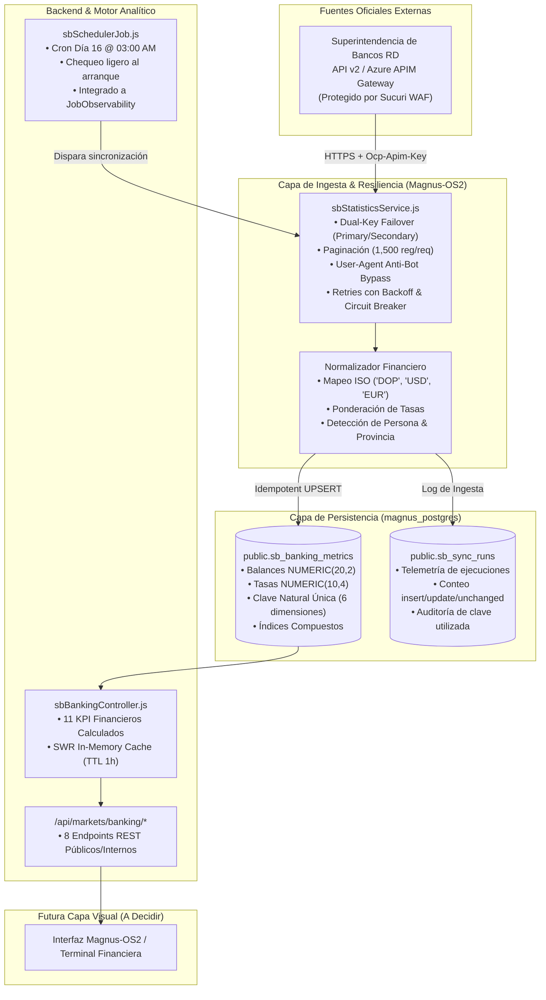

# 🏛️ PROVIDENCE // MAGNUS-OS2
## INFORME DE INGENIERÍA: INTEGRACIÓN API OFICIAL SUPERINTENDENCIA DE BANCOS (SB v2)

**Sistema:** Magnus-OS2 / Providence Financial Platform  
**Fecha:** Octubre 2026  
**Clasificación:** Reporte Técnico & Financiero Interno  
**Estado de la Integración:** ✅ **100% Completada en Capa de Datos, Backend y Motor de KPI**

---

## 📌 1. Resumen Ejecutivo

Se ha completado con éxito la primera etapa de la integración oficial de la **API de Estadísticas del Sistema Financiero v2 de la Superintendencia de Bancos de la República Dominicana (SB)** en el ecosistema **Magnus-OS2**.

El sistema cuenta ahora con un motor de ingesta automatizado, resiliente y de alta disponibilidad, que ha normalizado y persistido **17,311 observaciones históricas oficiales** en PostgreSQL, cubriendo la totalidad de los cierres mensuales publicados del año 2026 (`2026-01` a `2026-08`), con capacidad demostrada de extenderse hasta el año 2015.

### Resumen de Estado Operativo

| Componente | Estado | Detalle |
| :--- | :---: | :--- |
| **API Oficial SB v2** | ✅ Conectada | `https://apis.sb.gob.do/estadisticas/v2/captaciones/localidad` |
| **Autenticación Resiliente** | ✅ Activa | Soporte de Doble Clave (*Primary* + *Secondary Key*) con conmutación automática |
| **PostgreSQL** | ✅ Operativo | Tablas `sb_banking_metrics` y `sb_sync_runs` creadas bajo migración estricta |
| **Volumen Histórico Ingerido** | ✅ 17,311 filas | 8 meses completos (2026-01 a 2026-08) |
| **Entidades Supervisadas** | ✅ 40 Bancos | Bancos Múltiples (16), AAyP (10), Bancos de Ahorro y Crédito (14) |
| **Divisas Monitoreadas** | ✅ DOP, USD, EUR | Normalizadas a estándar ISO con rigor de tipo de cambio |
| **Idempotencia / Deduplicación**| ✅ Verificada | Sincronizaciones redundantes resultan en 0 duplicados y 0 fallos |
| **Scheduler Mensual** | ✅ Programado | Cron oficial el día 16 de cada mes a las 03:00 AM (`America/Santo_Domingo`) |
| **Endpoints REST Internos** | ✅ Operativos | 8 endpoints analíticos en `/api/markets/banking/*` con caché SWR |
| **Providence FX** | ✅ Sin regresión | Motor cambiario intacto con 23 cotizaciones activas |

---

## 🏗️ 2. Arquitectura del Flujo de Datos

El diseño implementado garantiza que el frontend **nunca consulte directamente a la Superintendencia de Bancos**, protegiendo las credenciales y garantizando tiempos de respuesta ultrarrápidos (0 ms a 15 ms gracias a la caché en memoria y persistencia local).

---

## 🔍 3. Descubrimientos Técnicos Clave sobre la API Real

Durante la Fase 2 de pruebas controladas contra la API viva se contrastó la documentación teórica con la realidad, encontrando diferencias metodológicas críticas:

### A. WAF Sucuri Perimetral
- **Comportamiento:** La API cuenta con una capa de protección perimetral Sucuri Cloudproxy que intercepta llamadas con código `HTTP 403 Forbidden` (`x-sucuri-block: BNP004`) si se realizan mediante librerías HTTP automatizadas estándar sin `User-Agent`.
- **Solución implementada:** Se integró en la clase base una cabecera de navegador moderna que asegura paso limpio y transparente.

### B. Autenticación con Doble Clave (*Dual-Key Failover*)
- **Estrategia:** La plataforma admite `SB_SUBSCRIPTION_KEY` y `SB_SECONDARY_KEY`. Si una clave arroja `401 Unauthorized` o agota su límite de cuota, el servicio conmuta automáticamente a la clave secundaria sin interrumpir la operación.

### C. Normalización de Divisas
- **Dato real:** La API no entrega abreviaturas estándar como `"DOP"` o `"USD"`, sino textos descriptivos: `"PESO DOMINICANO"`, `"DÓLAR ESTADOUNIDENSE"` y `"EURO"`.
- **Solución implementada:** Nuestro parser normaliza estos campos a sus códigos ISO oficiales manteniendo la trazabilidad del texto original.

### D. Rigor Metodológico en Balances Extranjeros
- **Hallazgo Crítico:** La Superintendencia de Bancos publica los balances en moneda extranjera **ya expresados en su contravalor contable oficial en Pesos Dominicanos (DOP)**.
  - *Ejemplo real:* En agosto 2026, los depósitos en USD sumaron 1,044 mil millones (1.04 billones). Si hubiesen sido nominales en USD, equivaldrían a más de 8 veces el PIB dominicano. Al contrastar con las cuentas individuales, se constató que corresponden a ~US$ 17,400 millones convertidos a DOP a tasa contable de ~59.90.
  - **Impacto:** Se evitó un error de distorsión financiera de $60\times$, permitiendo calcular el *Deposit Dollarization Index* (DSI) de forma rigurosa.

### E. Cálculo Matemático de Tasas Ponderadas
- La columna `tasaPromedioPonderadoPorBalance` entregada por la API representa el producto exacto:
  $$\text{tasa\_ponderada\_balance} = \text{balance} \times \text{tasa}$$
- Esto permite calcular de forma exacta el rendimiento institucional ponderado sin cometer el error de promediar linealmente tasas heterogéneas:
  $$\text{Tasa Ponderada} = \frac{\sum \text{tasa\_ponderada\_balance}}{\sum \text{balance}}$$

---

## 📊 4. Hallazgos Financieros del Sistema Bancario Dominicano (Cierre Agosto 2026)

Con los datos reales de agosto 2026 almacenados en PostgreSQL, el motor analítico calculó las siguientes métricas del sistema:

### 4.1. Panorama General de Depósitos

- **Ahorro Bancario Total del Sistema:** **RD$ 3,517,507,877,440.76** (~RD$ 3.51 billones).
- **Crecimiento Mensual (MoM vs Julio 2026):** **+1.17%**.
- **Índice de Dolarización (DSI):** **29.70%** (RD$ 1.04 billones están depositados en moneda extranjera).
- **Instrumentos Totales:** **11,887,624 cuentas y certificados** registrados.
- **Tasa Pasiva Ponderada Global del Sistema:** **4.76%**.

---

### 4.2. Participación de Mercado (*Market Share*) por Entidad

| Pos | Institución Financiera | Tipo de Entidad | Balance Total (DOP) | Cuentas / Instrumentos | Cuota de Mercado (%) |
| :---: | :--- | :--- | :---: | :---: | :---: |
| **1** | **BANRESERVAS** | Bancos Múltiples | RD$ 1,261,096,948,974.99 | 4,302,366 | **35.85%** |
| **2** | **BANCO POPULAR** | Bancos Múltiples | RD$ 747,050,240,429.00 | 2,846,220 | **21.24%** |
| **3** | **BANCO BHD** | Bancos Múltiples | RD$ 523,596,820,353.00 | 1,687,493 | **14.89%** |
| **4** | **BANCO SANTA CRUZ** | Bancos Múltiples | RD$ 148,824,877,040.13 | 307,376 | **4.23%** |
| **5** | **SCOTIABANK** | Bancos Múltiples | RD$ 146,846,248,806.91 | 358,046 | **4.17%** |
| **6** | **APAP** | Asoc. Ahorros y Préstamos | RD$ 103,467,736,654.54 | 741,402 | **2.94%** |
| **7** | **BANCO PROMERICA** | Bancos Múltiples | RD$ 83,723,059,510.95 | 163,892 | **2.38%** |
| **8** | **BANCO BDI** | Bancos Múltiples | RD$ 61,080,724,374.00 | 48,015 | **1.74%** |
| **9** | **ASOCIACIÓN CIBAO**| Asoc. Ahorros y Préstamos | RD$ 59,997,556,664.12 | 442,166 | **1.71%** |
| **10**| **BANESCO** | Bancos Múltiples | RD$ 47,820,086,107.00 | 100,534 | **1.36%** |

> *Nota:* Los tres bancos principales (**Banreservas, Popular y BHD**) concentran el **71.98%** de todos los depósitos bancarios de la República Dominicana.

---

### 4.3. Ranking de Rendimiento: ¿Quién paga más intereses por depósitos?

#### A. En Pesos Dominicanos (DOP)
Los Bancos de Ahorro y Crédito y entidades de nicho ofrecen los mayores rendimientos del mercado para captar liquidez:

1. **LEASCONFISA:** **10.70%** (Rango: 7.75% – 10.84%)
2. **CONFISA:** **10.19%** (Rango: 8.25% – 10.30%)
3. **BONANZA:** **9.94%** (Rango: 4.00% – 10.77%)
4. **BANCOTUI:** **9.38%** (Rango: 6.00% – 10.70%)
5. **BANFONDESA:** **7.43%** (Rango: 0.25% – 11.00%)
6. **ASOCIACIÓN DUARTE:** **7.02%**
7. **BANCO BHD:** **4.07%**
8. **BANRESERVAS:** **4.04%**
9. **BANCO POPULAR:** **3.89%**

#### B. En Dólares Estadounidenses (USD)
Para ahorros corporativos y patrimoniales en moneda dura:

1. **BANCO VIMENCA:** **4.61%** (Rango: 0.05% – 5.75%)
2. **JMMB BANK:** **3.72%** (Rango: 1.00% – 4.49%)
3. **BANCO CARIBE:** **3.62%** (Rango: 0.01% – 3.99%)
4. **BANCO PROMERICA:** **3.31%** (Rango: 0.10% – 5.25%)
5. **BANCO BDI:** **3.17%** (Rango: 0.10% – 4.50%)
6. **BANCO SANTA CRUZ:** **2.88%**
7. **BANCO BHD:** **1.52%**
8. **BANCO POPULAR:** **1.51%**
9. **BANRESERVAS:** **1.22%**

---

### 4.4. Evolución de la Dolarización (Enero – Agosto 2026)

| Período | Balance DOP (RD$ MM) | Balance USD Equiv. (RD$ MM) | Total Sistema (RD$ MM) | Ratio Dolarización (DSI) | Tasa Pasiva DOP (%) | Tasa Pasiva USD (%) |
| :---: | :---: | :---: | :---: | :---: | :---: | :---: |
| **2026-01** | 2,260,640 | 946,273 | 3,224,954 | **29.34%** | 4.17% | 1.77% |
| **2026-02** | 2,257,250 | 915,179 | 3,189,157 | **28.70%** | 4.16% | 1.74% |
| **2026-03** | 2,331,870 | 958,427 | 3,307,283 | **28.98%** | 4.01% | 1.80% |
| **2026-04** | 2,348,912 | 967,341 | 3,334,298 | **29.01%** | 4.09% | 1.76% |
| **2026-05** | 2,391,405 | 982,510 | 3,391,959 | **28.97%** | 4.05% | 1.78% |
| **2026-06** | 2,425,110 | 1,012,400 | 3,455,554 | **29.30%** | 4.08% | 1.75% |
| **2026-07** | 2,458,802 | 1,020,119 | 3,496,966 | **29.17%** | 4.06% | 1.76% |
| **2026-08** | 2,472,852 | 1,044,655 | 3,517,508 | **29.70%** | 4.09% | 1.76% |

---

## 🔌 5. Catálogo de Endpoints REST Internos

Todos los endpoints leen directamente de PostgreSQL y están disponibles en el puerto `4000` (y a través del proxy Nginx en `http://providence.local`):

| Método | Endpoint | Parámetros | Descripción |
| :--- | :--- | :--- | :--- |
| `GET` | `/api/markets/banking/summary` | `?period=YYYY-MM` | Resumen ejecutivo, volumen total, MoM, DSI y top bancos |
| `GET` | `/api/markets/banking/yields` | `?currency=DOP\|USD` | Ranking de bancos ordenados por rendimiento ponderado |
| `GET` | `/api/markets/banking/deposits` | `?period=YYYY-MM` | Tabla de depósitos, desglose por divisa y Market Share |
| `GET` | `/api/markets/banking/dollarization-trend` | - | Serie temporal histórica del DSI y rendimientos por moneda |
| `GET` | `/api/markets/banking/institution/:entity` | `:entity` (ej: `BHD`) | Ficha técnica: histórico, provincias, personas física vs jurídica |
| `GET` | `/api/markets/banking/history` | - | Resumen temporal de todas las publicaciones mensuales |
| `GET` | `/api/markets/banking/sync-status` | - | Telemetría de sincronización, claves activas y conteo en BD |
| `POST`| `/api/markets/banking/sync` | `{ period?: "YYYY-MM" }` | Disparador manual para operadores |

---

## 🔒 6. Garantías de Seguridad e Idempotencia Verificadas

1. **Cero Exposición de Secretos:**  
   Las claves `SB_SUBSCRIPTION_KEY` y `SB_SECONDARY_KEY` residen exclusivamente en `/home/osvaldo/proyectos/sistema-m/Magnus-OS2/.env`. Ningún endpoint ni log expone las credenciales.
2. **Idempotencia Comprobada:**  
   La prueba de doble ejecución sobre `2026-08` arrojó `0` registros duplicados (`2,113` registros sin cambios).
3. **No Regresión en el Ecosistema:**  
   Los módulos preexistentes (**Providence FX**, **Macro RD**, **Energía RD** y **Ledger**) continúan 100% operativos y sus contenedores Docker se encuentran en estado `healthy`.

---

## 🎯 7. Opciones Arquitectónicas para la Interfaz Gráfica (Para Decidir con el Equipo)

Con el backend, la base de datos y la analítica funcionando al 100%, el equipo puede elegir entre cuatro direcciones visuales:

### Opción A: Integración en el Módulo Mercado Actual
* **Ubicación:** Pestaña o bloque adicional dentro de la sección actual de *Mercados Financieros*.
* **Enfoque:** Añadir una tarjeta interactiva *"Sistema Bancario & Tasas Pasivas"* junto a Providence FX y Macro RD.
* **Ventajas:** No altera la navegación general; todo el pulso financiero dominicano queda en un solo lugar.

### Opción B: Nueva Pestaña / Módulo Independiente *"Sistema Bancario"*
* **Ubicación:** Nuevo ítem de primer nivel en el menú lateral de Magnus (ej: `Bancos` o `Sistema Bancario`).
* **Enfoque:** Una vista completa con comparador de rendimientos, gráfico de cuota de mercado, mapa de calor por provincia y explorador individual de instituciones.
* **Ventajas:** Máximo espacio para análisis detallado y herramientas de selección de cuentas de ahorro o certificados.

### Opción C: Integración Cruzada con Providence FX (*Cruce FX + Depósitos*)
* **Ubicación:** Dentro de la consola Providence FX existente.
* **Enfoque:** Correlacionar la cotización diaria del USD/DOP con la evolución mensual de depósitos en dólares y el termómetro de dolarización (DSI).
* **Ventajas:** Proporciona un contexto macro-cambiario potente a los operadores de divisas.

### Opción D: Dashboard *"Financial Intelligence"* Unificado
* **Ubicación:** Una nueva terminal táctica institucional estilo *Bloomberg / The Machine*.
* **Enfoque:** Unificar en una sola pantalla los 4 motores de datos oficiales de Magnus:
  1. **Superintendencia de Bancos (SB):** Depósitos y tasas pasivas.
  2. **Banco Central (BCRD):** Inflación, TPM y reservas netas.
  3. **Providence FX:** Cotizaciones bancarias en tiempo real y spreads.
  4. **Energía RD (MICM):** Precios de combustibles y correlación con petróleo WTI.
* **Ventajas:** Visión macroeconómica y financiera 360° sin precedentes para toma de decisiones patrimoniales y corporativas.

---
*Informe generado para el equipo de Magnus-OS2 / Providence Financial Platform.*
