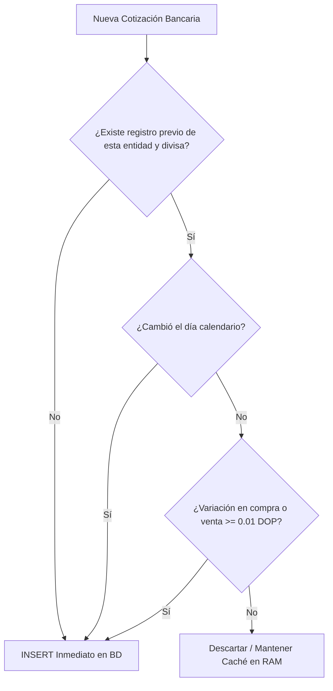

# 🏛️ Documento de Arquitectura y Estrategia: Motor FX y API Estadísticas SB v2

**Sistema:** Magnus-OS2 / Providence Financial Platform  
**Fecha de Elaboración:** Octubre 2026  
**Audiencia:** Equipo de Ingeniería, Analistas Financieros, Integradores y Modelos de Inteligencia Artificial (IAs)

---

## 📌 1. Resumen Ejecutivo

Este documento consolida dos pilares estratégicos de la inteligencia financiera en **Magnus-OS2**:
1. **Estado y persistencia del mercado cambiario actual (Providence FX):** Cómo opera el guardado histórico de cotizaciones de ventanilla (USD/EUR) de los bancos dominicanos (BHD, Banreservas, Scotiabank, APAP, etc.) y su resiliencia ante reinicios y traslados físicos del servidor.
2. **Integración de la API Oficial de la Superintendencia de Bancos (SB v2):** Propuesta de arquitectura, casos de uso institucionales, estructura de datos y plan de trabajo para explotar las estadísticas del sistema financiero dominicano (captaciones, tasas pasivas ponderadas, dolarización de depósitos y solvencia bancaria).

---

## 💵 2. Motor Cambiario Actual (Providence FX) & Persistencia de Datos

### 2.1. Arquitectura de Almacenamiento
* **Base de Datos:** PostgreSQL institucional (`magnus_postgres`), tabla canónica `fx_rate_observations`.
* **Persistencia Hardware:** La base de datos corre con volúmenes montados en disco local. **El apagado, desconexión física o traslado del servidor entre la casa y la oficina NO elimina ni altera el histórico.**
* **Métricas actuales en producción:** Más de 220 observaciones registradas de entidades clave (Banreservas, Banco BHD, Scotiabank, APAP, Asociación Cibao, entre otras).

### 2.2. Política de Deduplicación Inteligente
Para prevenir saturación por registros idénticos minuto a minuto, la función `persistObservationsToDb` implementa la siguiente lógica:


### 2.3. Cronogramas y Ciclo de Vida del Scheduler
* **Horario Bancario RD:** Lunes a Viernes, cada hora en punto entre **07:00 AM y 08:00 PM** (`0 7-20 * * 1-5`, `America/Santo_Domingo`).
* **Cierre Diario:** Lunes a Viernes a las **11:00 PM** (`0 23 * * 1-5`).
* **Comportamiento tras Reinicio / Encendido:** Cuando el servidor se enciende tras un traslado, el primer acceso al módulo de Mercado en la interfaz web detecta la memoria volátil vacía, levanta de inmediato el último snapshot de PostgreSQL y dispara un refresco asíncrono (*Single-Flight Mutex*) para registrar las tasas vivas del momento.

---

## 🏛️ 3. API Estadísticas del Sistema Financiero v2 (Superintendencia de Bancos RD)

### 3.1. Generalidades de la API
* **Portal de Desarrolladores:** `https://desarrollador.sb.gob.do/`
* **Tipo de Arquitectura:** RESTful sobre Azure API Management Gateway.
* **Autenticación:** Cabecera HTTP requerida:
  ```http
  Ocp-Apim-Subscription-Key: <PRIMARY_KEY>
  ```
* **Plan Suscrito:** **Analista** (Hasta 120 llamadas por minuto, sin costo).
* **Frecuencia de Actualización:** Mensual (Cierres contables oficiales de la banca supervisada, formato de consulta `periodoInicial=YYYY-MM`).

---

### 3.2. Endpoint Clave: Captaciones por Localidad
* **URL:** `https://apis.sb.gob.do/estadisticas/v2/captaciones/localidad`
* **Método:** `GET`
* **Parámetros principales de consulta:**
  * `periodoInicial` (Obligatorio, string `YYYY-MM` ej: `2024-01`).
  * `periodoFinal` (Opcional, string `YYYY-MM`).
  * `entidad` (Opcional, array ej: `[ BHD, RESERVAS, POPULAR ]`).
  * `tipoEntidad` (Opcional, array ej: `[ BM, AAyP, BAyC ]` donde `BM` = Banco Múltiple).
  * `paginas`, `registros` (Enteros para paginación).

#### Estructura de Respuesta JSON:
```json
{
  "periodo": "2024-01",
  "tipoEntidad": "BM",
  "entidad": "BANCO MULTIPLE BHD, S.A.",
  "region": "Ozama",
  "provincia": "Distrito Nacional",
  "codIso": "DO-01",
  "persona": "Fisica",
  "divisa": "USD",
  "cantidadInstrumento": 14250,
  "balance": 284500000.50,
  "tasaPromedioPonderadoPorBalance": 3.85,
  "tasaPromedioPonderado": 3.72
}
```

---

## 💡 4. Casos de Uso y Propuesta de Valor para Magnus-OS2

```
                       ┌───────────────────────────────────────┐
                       │   Superintendencia de Bancos (SB API) │
                       │    Estadísticas Mensuales v2          │
                       └──────────────────┬────────────────────┘
                                          │ (Ocp-Apim-Subscription-Key)
                                          ▼
                         ┌─────────────────────────────────┐
                         │   server/services/sb/           │
                         │   sbStatisticsService.js        │
                         └────────────────┬────────────────┘
                                          ▼
                      ┌───────────────────┴───────────────────┐
                      ▼                                       ▼
        ┌───────────────────────────┐           ┌───────────────────────────┐
        │  Módulo Rendimiento /     │           │  Módulo Macro /           │
        │  Tasas Pasivas (Yield)    │           │  Dolarización & Riesgo    │
        ├───────────────────────────┤           ├───────────────────────────┤
        │ • Rendimiento en DOP/USD  │           │ • Ratio depósitos USD/DOP │
        │ • Comparador de Bancos    │           │ • Solvencia institucional │
        │ • Dónde invertir liquidez │           │ • Presión cambiaria macro │
        └───────────────────────────┘           └───────────────────────────┘
```

### Caso 1: Comparador de Rendimiento de Capital (Tasas Pasivas Reales)
* **Objetivo:** Responder a la pregunta: *¿Qué banco en RD está pagando más intereses por tener dinero en cuentas de ahorro o depósitos a plazo en DOP y en USD?*
* **Métrica clave:** `tasaPromedioPonderadoPorBalance`. Permite contrastar la tasa real que paga Banreservas vs. BHD vs. APAP vs. Bancos de Ahorro y Crédito.
* **Integración:** Una pestaña **"Rendimiento de Inversión"** en la terminal financiera de Magnus.

### Caso 2: Termómetro de Dolarización del Sistema Financiero
* **Objetivo:** Detectar si el público y las corporaciones se están refugiando en dólares antes de que la tasa de cambio suba con fuerza.
* **Cálculo:**
  $$\text{Índice de Dolarización} = \frac{\sum \text{Balance USD convertidos a DOP}}{\sum \text{Balance Total en el Sistema}} \times 100$$
* **Beneficio:** Cruce predictivo directo con el servicio **Providence FX**.

### Caso 3: Mapa de Concentración y Solvencia Bancaria
* **Objetivo:** Conocer la estabilidad y volumen de los bancos donde la empresa u organización tiene cuentas maestras.
* **Beneficio:** Visualizar el crecimiento de activos, fuga o atracción de depósitos por entidad bancaria.

---

## 🛠️ 5. Hoja de Ruta Técnica para Mañana

### Fase 1: Configuración de Entorno & Pruebas
1. Agregar la clave al archivo `.env` de producción en `Magnus-OS2`:
   ```bash
   # ---- Superintendencia de Bancos (SB) API ----
   SB_API_BASE_URL=https://apis.sb.gob.do/estadisticas/v2
   SB_SUBSCRIPTION_KEY=tu_primary_key_aqui
   SB_ENABLED=true
   ```
2. Ejecutar un script de prueba (*PoC*) en Node.js para validar respuesta de la API y códigos de estado.

### Fase 2: Modelo de Datos en PostgreSQL
Crear la migración para almacenar las estadísticas mensuales:
```sql
CREATE TABLE IF NOT EXISTS public.sb_banking_metrics (
    id SERIAL PRIMARY KEY,
    periodo VARCHAR(7) NOT NULL,            -- 'YYYY-MM'
    entidad VARCHAR(150) NOT NULL,
    tipo_entidad VARCHAR(10),
    provincia VARCHAR(100),
    persona VARCHAR(50),                    -- 'Fisica' | 'Juridica'
    divisa VARCHAR(5) NOT NULL,             -- 'DOP' | 'USD' | 'EUR'
    cantidad_instrumentos INTEGER,
    balance NUMERIC(20, 2),
    tasa_ponderada_balance NUMERIC(8, 4),
    tasa_ponderada NUMERIC(8, 4),
    created_at TIMESTAMP WITH TIME ZONE DEFAULT NOW(),
    CONSTRAINT uq_sb_metric UNIQUE (periodo, entidad, tipo_entidad, provincia, persona, divisa)
);

CREATE INDEX IF NOT EXISTS idx_sb_metrics_periodo ON public.sb_banking_metrics (periodo);
CREATE INDEX IF NOT EXISTS idx_sb_metrics_entidad ON public.sb_banking_metrics (entidad);
CREATE INDEX IF NOT EXISTS idx_sb_metrics_divisa ON public.sb_banking_metrics (divisa);
```

### Fase 3: Servicio Orquestador & Scheduler
* Crear `server/services/sb/sbStatisticsService.js`.
* Configurar un cron mensual (por ejemplo, el día 16 de cada mes a las 03:00 AM) para sincronizar los nuevos cierres publicados por la Superintendencia.
* Añadir llamada de arranque opcional en `server/index.js` para asegurar que el sistema siempre tenga el mes más reciente cargado.

### Fase 4: Endpoints REST en el Backend
* `GET /api/markets/banking/yields?currency=USD`: Ranking de entidades por tasa pasiva ponderada.
* `GET /api/markets/banking/dollarization-trend`: Serie temporal de depósitos USD vs DOP.
* `GET /api/markets/banking/institution/:entity`: Ficha de depósitos y volumen de un banco específico.

---

## 💻 6. Snippet de Referencia para Pruebas (Node.js & cURL)

### Prueba directa vía Terminal (cURL):
```bash
curl -X GET "https://apis.sb.gob.do/estadisticas/v2/captaciones/localidad?periodoInicial=2024-01&registros=10" \
  -H "Ocp-Apim-Subscription-Key: TU_PRIMARY_KEY" \
  -H "Accept: application/json"
```

### Implementación en Node.js (ES Modules / Axios o Fetch):
```javascript
export async function fetchSbCaptaciones({ periodoInicial, entidad = null, registros = 50 }) {
    const apiKey = process.env.SB_SUBSCRIPTION_KEY;
    const baseUrl = process.env.SB_API_BASE_URL || 'https://apis.sb.gob.do/estadisticas/v2';
    
    const params = new URLSearchParams({
        periodoInicial,
        registros: String(registros)
    });
    if (entidad) params.append('entidad', entidad);

    const response = await fetch(`${baseUrl}/captaciones/localidad?${params.toString()}`, {
        method: 'GET',
        headers: {
            'Ocp-Apim-Subscription-Key': apiKey,
            'Accept': 'application/json'
        }
    });

    if (!response.ok) {
        throw new Error(`Error en API SB [${response.status}]: ${response.statusText}`);
    }

    return await response.json();
}
```

---

## 🤝 7. Ideas para Discutir con el Equipo y otras IAs

1. **¿Qué bancos monitorear de forma prioritaria?**
   ¿Filtramos únicamente la banca múltiple de primer nivel (Banreservas, Popular, BHD, Scotiabank) o incluimos asociaciones de ahorros (APAP, ACAP) y bancos de crédito (ADEMI) para captar mejores nichos de rendimiento?
2. **Alertas tempranas de liquidez:**
   ¿Queremos que Magnus envíe una notificación (vía WebSocket / Socket.io al dashboard) cuando la SB publique un nuevo mes con caídas significativas de depósitos en alguna entidad de interés?
3. **Cruzamiento con el módulo de Finanzas personales/empresariales:**
   Si la organización tiene cuentas bancarias registradas en el Ledger de Magnus, vincular automáticamente la tasa oficial que la entidad debería estar pagando frente al rendimiento real recibido en extractos.
