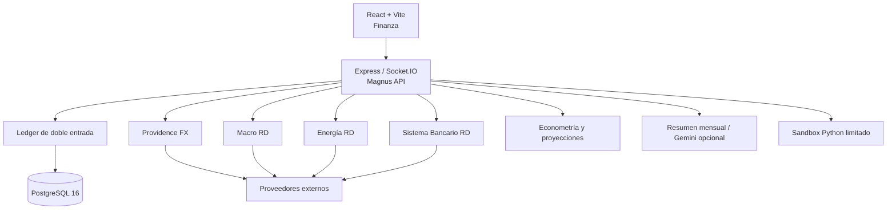
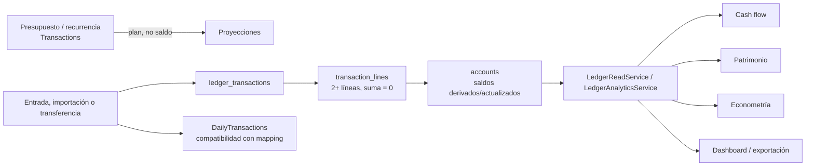
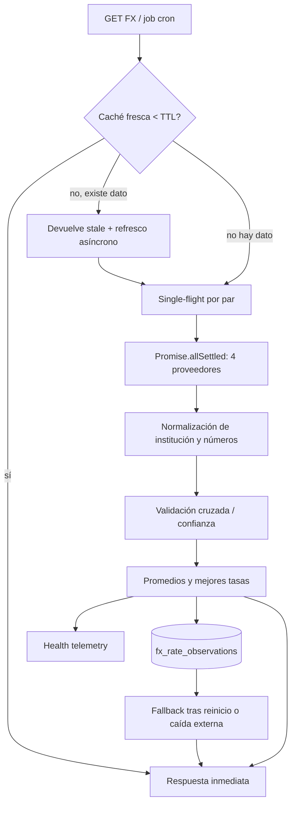
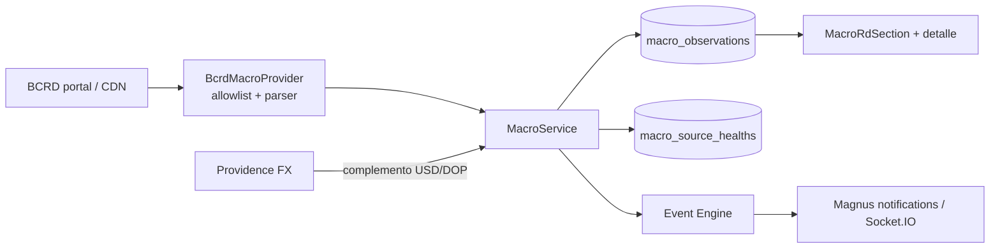

# MagnusOS: tecnologías recientes, funcionamiento y guía de evolución

**Fecha:** 2026-10-10  
**Base de evidencia:** código fuente, migraciones, Compose, rutas, modelos, jobs y auditoría en vivo de la Dell.  
**Objetivo:** documento técnico para continuar desarrollando MagnusOS sin confundir lo que existe, lo que está en transición y lo que aún es roadmap.  
**Límite:** no incluye secretos, datos personales ni resultados de consultas financieras.

## 1. Qué es MagnusOS hoy

MagnusOS es una plataforma financiera personal/autohospedada construida como una aplicación unificada: frontend React/Vite compilado, API Express/Node, PostgreSQL 16, Docker Compose y un sandbox Python separado. Su núcleo no es un dashboard de cotizaciones: es un **ledger de doble entrada** sobre el cual se apoyan cuentas, flujo de caja, patrimonio, ahorro, importación, análisis econométrico y resúmenes mensuales.

Encima del núcleo financiero existen cuatro dominios de inteligencia de mercado:

1. **Providence FX:** tasas bancarias USD/DOP y EUR/DOP, referencias BCRD/Yahoo y comparación entre proveedores.
2. **Macro RD:** indicadores del BCRD, series históricas, revisiones y eventos/alertas.
3. **Energía RD:** precios y política semanal de combustibles del MICM.
4. **Sistema Bancario RD (SB v2):** captaciones, tasas pasivas, concentración, dolarización y geografía institucional.

El sistema está desplegado en Docker. En la evidencia del 2026-10-10, la API, PostgreSQL y sandbox de Magnus estaban `healthy`; las migraciones `000`–`011` estaban aplicadas y con checksum válido. Eso valida la presencia del esquema y sus invariantes, pero no certifica por sí mismo cada dato histórico ni la exactitud de fuentes externas.



## 2. Capas tecnológicas y responsabilidades

| Capa | Tecnología / ubicación | Responsabilidad | Regla de evolución |
|---|---|---|---|
| Web | React 18, TypeScript, Vite, Recharts | Pantallas financieras, terminal de mercado y formularios | No calcular verdad contable en el navegador |
| API | Express, Socket.IO, JWT, Helmet, `express-rate-limit` | Autorización, contratos REST, orquestación | Validar identidad y datos antes de cada mutación |
| Persistencia | PostgreSQL 16 + Sequelize + SQL versionado | Ledger, datos macro, FX, SB, jobs y snapshots | Migraciones forward-only; nunca `sync` en producción |
| Trabajos | `node-cron`, `jobObservability` y leases DB | Ingesta recurrente, telemetría y recuperación | Cada job debe ser idempotente y observable |
| Mercado | `fetch`, Cheerio, normalizadores y caches SWR | Ingesta de fuentes externas heterogéneas | Separar fuente, timestamp, calidad y dato derivado |
| Analítica | JS/BigInt + regresiones locales; Python sandbox disponible | Forecast, anomalías, contexto mensual | Los modelos consumen sólo datos reproducibles y fechados |
| Operación | Docker Compose, healthchecks, límites RAM/PID | Despliegue y recuperación | No publicar DB ni sandbox al host |

La API productiva sirve el frontend compilado desde `dist`, expone el puerto 4000 y depende de PostgreSQL interno. Compose limita el proceso Magnus a 2 GiB, PostgreSQL a 1 GiB y el sandbox a 512 MiB/1 CPU. En la Dell hay mayor margen que en la VM anterior, pero el host mantiene muchos servicios ajenos a Magnus: se debe presupuestar capacidad antes de activar modelos locales pesados.

## 3. Núcleo financiero: la fuente de verdad

### 3.1 Modelo mental

El principio objetivo es simple:

- **Dinero real:** `ledger_transactions` + `transaction_lines` + `accounts`.
- **Planificación:** `Transactions`, conceptualmente presupuestos/recurrencias; no forma parte del patrimonio real.
- **Compatibilidad histórica:** `DailyTransactions`; debe mantener mapeo 1:1 con ledger y mutar atómicamente con él.
- **Visualización:** dashboards, gráficos, reportes y snapshots leen modelos derivados; no originan saldos.



### 3.2 Invariantes implementadas

Las migraciones activas verificadas implementan:

- Dos o más líneas por asiento y suma cero diferida a commit.
- Un asiento ordinario no mezcla monedas; una operación cruzada debe representarse mediante asientos enlazados/puente explícito.
- Moneda de línea igual a la moneda de su cuenta.
- Cuenta de cada línea perteneciente al mismo usuario del encabezado.
- Valores monetarios del ledger en `BIGINT` de unidades menores, sin coma flotante.
- Conversión y consistencia de tablas legacy mediante campos `*_minor`; siguen existiendo campos `FLOAT`, por compatibilidad, no como precisión preferida.
- Mapeo único `DailyTransactions → ledger_transactions` y leases de job distribuidos.
- Estadísticas SB con `NUMERIC` y llave natural única.

El controlador de ledger valida usuario efectivo desde JWT, bloquea las cuentas que muta, verifica pertenencia, rango `BIGINT`, moneda, suma por moneda y transferencias internas de dos líneas opuestas. Las restricciones están en dos capas: aplicación para dar errores claros y PostgreSQL para impedir commits inválidos aunque otro cliente eluda la API.

### 3.3 Qué no debe hacerse

- No sumar `Transactions` (planes) a cashflow o patrimonio realizado.
- No permitir que una UI calcule/guarde balances como fuente primaria.
- No usar `Number`/`FLOAT` para crear dinero nuevo; aceptar strings decimales y convertir a unidades menores.
- No abrir PostgreSQL para resolver necesidades del frontend.
- No eliminar `DailyTransactions` hasta que el cutover y consumidores legacy se hayan auditado.

## 4. Providence FX: motor cambiario RD

Providence FX resuelve una necesidad específica: en RD las tasas bancarias minoristas no llegan por una fuente pública única y homogénea. Por eso no debe confundirse una tasa de ventanilla con la referencia oficial ni con el spot internacional.

### 4.1 Pares y tipos de tasa

El servicio opera actualmente con **USD/DOP** y **EUR/DOP**. Internamente admite `USD/DOP`, `EUR/DOP` y normaliza separadores. Cada observación se clasifica:

| Tipo | Fuente típica | Uso correcto |
|---|---|---|
| `RETAIL_BANK` | Bancos capturados por agregadores | Decidir dónde comprar/vender divisa en ventanilla |
| `AGGREGATOR` | TasaReal / InfoDolar | Vehículo de distribución, no autoridad monetaria |
| `OFFICIAL_REFERENCE` | BCRD | Ancla regulatoria/macro, no necesariamente precio de ventanilla |
| `MARKET` | Yahoo (`DOP=X`, `EURDOP=X`) | Benchmark internacional, no cotización bancaria RD |
| `DERIVED / BENCHMARK` | `EUR/USD × USD/DOP` | Control analítico para EUR, no tasa ejecutable |

### 4.2 Flujo completo



1. La API o un job solicita el par.
2. `FxService` revisa la caché de memoria por par. Si no venció el TTL, responde sin red.
3. Si el dato venció pero existe, responde el último snapshot marcado `stale` y activa refresco de fondo (SWR).
4. Un mutex `activeRefreshPromises` evita que solicitudes simultáneas dupliquen el refresco para el mismo par.
5. TasaReal, InfoDolar, BCRD y Yahoo se consultan concurrentemente mediante `Promise.allSettled`; el fallo de una fuente no tumba las restantes.
6. Se normalizan entidades, se agrupan observaciones por institución y se evalúa discrepancia compra/venta.
7. Se calculan promedio de compra/venta/spread y mejores tasas, excluyendo estados `CONFLICT`.
8. Se persiste una observación discreta si cambió el día, el valor por al menos 0.01 DOP o el estado de validación.
9. Se persiste telemetría del proveedor; al reiniciar, el último snapshot se reconstruye desde BD si no existe caché RAM.

### 4.3 Proveedores actuales

| Provider | Implementación | Fortalezas | Riesgos / tratamiento |
|---|---|---|---|
| TasaReal | API con bearer configurado; filtrado por moneda | Datos estructurados y prioridad de consolidación | Requiere clave; puede deshabilitarse; depender de contrato/cuota |
| InfoDolar | HTML con Cheerio; tablas y `td[data-order]` | Alternativa sin clave; múltiples bancos | Cambio de DOM; exige mínimo 3 instituciones válidas |
| BCRD provider | Endpoint comunitario de referencia, no el portal BCRD directo | Tasa oficial separada del retail | Dependencia de intermediario; migrar a artefacto oficial BCRD cuando exista ruta estable |
| Yahoo | API chart; USD `DOP=X`, EUR `EURDOP=X` + `EURUSD=X` | Benchmark global y cambio/prevClose | No es precio ejecutable local; proveedor no contractual |

Cada provider hereda `BaseFxProvider`: timeout configurable (por defecto 7 s), hasta 3 reintentos con backoff/jitter y circuit breaker. Tras 5 fallos consecutivos el circuito queda `OPEN` durante 15 minutos; después pasa a `HALF_OPEN` para una prueba. La telemetría registra éxito, latencia, número de filas, error resumido, reintentos y estado del circuito.

### 4.4 Normalización y calidad

`normalizer.js` transforma nombres diferentes de una misma institución a un identificador canónico (por ejemplo Banreservas, Popular, BHD y APAP) y sanea valores numéricos. El sistema calcula:

```text
spread = sell - buy
mid    = (buy + sell) / 2
```

Se descartan cotizaciones fuera de rango plausible y el parser InfoDolar registra, sin aceptar ciegamente, spreads invertidos. La comparación entre fuentes utiliza la máxima discrepancia de compra o venta para una institución:

| Diferencia absoluta | Estado | Confianza de consenso |
|---:|---|---:|
| ≤ 0.05 DOP | `VERIFIED` | 1.00 |
| ≤ 0.15 DOP | `ACCEPTABLE` | 0.85 |
| ≤ 0.50 DOP | `WARNING` | 0.60 |
| > 0.50 DOP | `CONFLICT` | 0.30 |
| una sola fuente | `SINGLE_SOURCE` | 0.75 |

La confianza es **consenso entre fuentes**, no probabilidad de que la tasa sea ejecutable. En conflicto grave se conservan observaciones para auditoría pero se excluyen del cálculo de mejor tasa.

### 4.5 EUR/DOP y precaución analítica

Para EUR, Yahoo consulta `EURDOP=X` y `EURUSD=X`. Además se calcula un benchmark triangular:

```text
EUR/DOP implícito = EUR/USD × USD/DOP
```

Si no existe USD/DOP fresco se puede caer al promedio de venta en caché y, como último valor de continuidad, constantes internas. Esto permite disponibilidad visual, pero es una señal de diseño a mejorar: cualquier fallback fijo debe declararse explícitamente como **estimación degradada**, nunca presentarse como mercado en vivo ni usarse para contabilización.

### 4.6 Datos FX y contratos REST

`fx_rate_observations` conserva institución, provider, tipo de tasa, par, compra/venta/mid/spread, confianza, estado de validación y timestamps. `fx_provider_healths` conserva telemetría. Los tipos de cambio de estas tablas son `FLOAT`: apropiados para telemetría/mercado, pero no deben convertirse en importes del ledger sin una regla explícita de redondeo, fuente y fecha.

| Endpoint | Uso | Estado de acceso actual |
|---|---|---|
| `GET /api/markets/fx/usd-dop` | Consolidado USD/DOP | Público |
| `GET /api/markets/fx/eur-dop` | Consolidado EUR/DOP | Público |
| `GET /api/markets/fx/pair/:pair` | Par normalizado | Público |
| `GET /api/markets/fx/history/:institution` | Serie histórica | Público |
| `GET /api/markets/fx/evaluation/tasareal` | Evaluación de trial | Público en el router actual |
| `POST /api/markets/fx/refresh` | Fuerza llamada externa y escritura de telemetría/histórico | **Sólo JWT opcional: corregir** |

El frontend usa `FxMercadoModal.tsx` para abrir el terminal FX, cambiar USD/EUR, solicitar historia y mostrar evaluación. `MarketIntel.tsx` conserva el tablero global Yahoo; éste no debe reemplazar a Providence FX porque tiene semántica y persistencia diferentes.

### 4.7 Scheduler FX

El job corre en `America/Santo_Domingo`, de lunes a viernes, cada hora entre 07:00 y 20:00 y una vez adicional a las 23:00. Refresca USD/DOP y EUR/DOP y lo registra mediante `jobObservability`. Es un buen calendario base; para producción madura se debe añadir calendario de feriados dominicanos, política de fin de semana y alerta cuando `maxStaleHours` exceda 24 h.

## 5. Mercado global y `CurrencyHistory`: dos subsistemas distintos

`marketController` descarga una lista de instrumentos Yahoo: FX, índices, energía, commodities y cripto. Usa lote con concurrencia máxima 5, timeout de 7–8 s, caché RAM de 60 s y `lastGoodMap` para no convertir fallos transitorios en cero visible. Sus GET son de lectura: la escritura a `CurrencyHistory` se separó hacia `POST /api/markets/sync-rates` y el job diario `currencyRateJob`.

`CurrencyHistory` es legado de tipo de cambio general: a las 06:00 consulta `open.er-api.com` para USD→DOP y calcula EUR→DOP mediante cruce. Providence FX, en cambio, conserva precios bancarios por institución y proveedor. No mezclar ambas series sin etiquetar su metodología.

**Punto de atención:** el job diario hace `create` de `CurrencyHistory`; su semántica de deduplicación debe revisarse frente a la restricción real de BD. El método explícito `syncDatabaseRates` sí busca/actualiza por fecha/código. La evolución correcta es una llave única `(date, code, source/metodología)` y UPSERT idempotente.

## 6. Macro RD

Macro RD implementa un catálogo maestro BCRD para inflación interanual/mensual/subyacente, TPM, tasas activa/pasiva/interbancaria, IMAE, crédito privado, reservas y USD/DOP oficial. La ingesta actual analiza el portal del BCRD con Cheerio y allowlist de host (`bancentral.gov.do` y CDN), timeout de 9 s, rangos plausibles y parsing semántico de tablas.



`MacroObservation` contiene período de referencia, valor, unidad, frecuencia, `publishedAt`, `observedAt`, revisión, valores previos/cambios y metadata; esto es una base útil para trazabilidad. Aun así, para evitar sesgo de anticipación hay que estandarizar la fecha de publicación real por release y no usar solamente fecha de observación/ingesta.

El scheduler consulta BCRD lunes–viernes a las 08:30 y 16:30, y añade una ventana 20:00 en días 28–31 para TPM. El servicio usa caché SWR de 60 minutos, catálogo maestro, health de fuente y event engine. La UI está en `MacroRdSection.tsx` y `MacroDetailModal.tsx`.

**Riesgo actual de API:** `POST /api/markets/macro/refresh` recibe JWT opcional. Aunque el usuario no autenticado no lea datos privados, el endpoint puede disparar ingesta y escritura. Debe migrar a `requireAuthenticated` o `requireAdmin`, con rate limit específico.

**Inconsistencia a corregir:** el fallback macro que intenta complementar `USD_DOP_BCRD` consulta `fxUsd.summary.institutions`, pero el contrato actual de Providence FX entrega instituciones en `fxUsd.banks`. En consecuencia, ese fallback no encuentra la entidad aunque FX sí la haya obtenido. Debe corregirse el acceso, añadir una prueba de contrato entre ambos módulos y conservar la procedencia (`BCRD directo` versus `BCRD vía FX`).

## 7. Energía RD

Energía RD modela precios semanales y decisiones públicas de combustibles. Incluye catálogo canónico, observaciones, períodos de política y salud de fuente. La capa de presentación usa `EnergyRdSection.tsx` y `FuelDetailModal.tsx`.

El scheduler está adaptado a la publicación: viernes 11:00–17:00 cada 30 minutos, sábado 08:00 y comprobaciones ligeras lunes/jueves a las 12:00, zona RD. Esto es más adecuado que polling continuo y reduce dependencia externa.

**Riesgo actual de API:** `POST /api/markets/energy-rd/sync` no tiene middleware de autenticación en el router. Es una mutación/ingesta pública en la implementación actual y debe protegerse antes de ampliar exposición. También se recomienda separar claramente precio oficial publicado, fecha de vigencia y timestamp de ingesta.

## 8. Sistema Bancario RD (SB v2)

SB v2 consume estadísticas oficiales para construir una visión sistémica, no una cuenta bancaria del usuario. El esquema `sb_banking_metrics` registra período, entidad, tipo, región/provincia, titularidad, divisa/código ISO, instrumentos, balance y tasa ponderada; usa `NUMERIC/DECIMAL` para importes y tasas. `sb_sync_runs` guarda estado, cantidad de filas, duración, llave activa y metadatos de cada carga.

La ingesta es paginada, normalizada e idempotente mediante UPSERT de lotes. La política de scheduler intenta sincronización mensual el día 16 a las 03:00 RD y hace una comprobación a los 15 segundos del arranque. Puede rotar clave primaria/secundaria ante condiciones transitorias; los valores de claves no se exponen al cliente.

Los controladores calculan y cachean por una hora:

- balance total y variación mensual;
- rendimiento pasivo ponderado;
- top entidades y cuota;
- **DSI** = depósitos USD equivalentes DOP / total del sistema;
- **HHI** = suma de cuadrados de cuotas de mercado (0–10,000), con clasificación baja/moderada/alta;
- distribución física/jurídica, geografía, histórico y ficha de institución.

La UI dedicada vive en `/finanza/banca`: resumen, rendimientos, instituciones/captaciones, dolarización, geografía e histórico. Los GET son actualmente públicos; `POST /sync` exige JWT y admin. La documentación antigua debe tratarse con cuidado: algunos documentos mencionan nombres de tablas anteriores; el código y la migración 011 verificadas establecen como nombres canónicos `sb_banking_metrics` y `sb_sync_runs`.

## 9. Econometría, proyecciones y análisis mensual

### 9.1 Econometría actual

`LedgerAnalyticsService` entrega datasets por usuario desde el ledger. `econometricsService` implementa regresión OLS, propensión marginal a consumir/ahorrar, forecast de liquidez a 30 días con bandas y detección de anomalías por gasto/categoría. `FinancialAnomaly` persiste anomalías, y el usuario puede justificar una sin modificar el asiento contable.

Los endpoints econométricos sí exigen JWT. Esto es la arquitectura adecuada: análisis personal queda detrás de identidad efectiva y no usa el dataset de otro usuario salvo rol autorizado.

### 9.2 Proyecciones y Monte Carlo

La página `Projections.tsx` consume forecast/econometría. El código actual evidencia forecast determinista/estadístico; **no se debe declarar Monte Carlo productivo** hasta que exista un motor versionado, pruebas de reproducibilidad y registro de semillas, supuestos, dataset de corte, horizonte y resultados.

Un Monte Carlo correcto debe trabajar con:

```text
forecast_run_id
user_id (o agregado anonimizado)
as_of_at
ledger_snapshot_hash
assumptions_version
random_seed
distribution_parameters
scenario_count
result_quantiles (P05/P50/P95)
created_at
```

No debe mezclar retornos de mercado, FX o macro futuros con información que no hubiera sido publicada en `as_of_at`.

### 9.3 Resumen mensual e IA opcional

`monthlyAnalysisJob` lee timeline normalizado del ledger por usuario, calcula métricas con `BigInt` y opcionalmente llama una vez a Gemini para generar narrativa, alertas y recomendaciones. El resultado va a `monthly_snapshots`. Si Gemini no está configurado, conserva análisis sin IA.

Antes de ampliar esta función: minimizar datos enviados al modelo, no incluir descripciones crudas/transacciones si basta con agregados, registrar versión de prompt/modelo, permitir desactivación por usuario y separar recomendaciones de cualquier acción automática.

## 10. APIs: mapa operativo y decisiones de seguridad

| Área | GET de lectura | POST/PUT/PATCH/DELETE | Situación |
|---|---|---|---|
| Ledger, cuentas, importación, wealth | `/api/finanza/*` | operaciones financieras | JWT obligatorio |
| Econometría | `/api/econometrics/*` | detectar/justificar anomalías | JWT obligatorio |
| FX Providence | `/api/markets/fx/*` | `/fx/refresh` | GET público; refresh debe endurecerse |
| Macro RD | `/api/markets/macro/*` | `/macro/refresh` | GET público; refresh debe endurecerse |
| Energía RD | `/api/markets/energy-rd/*` | `/sync` | **sync hoy es público; corregir** |
| SB | `/api/markets/banking/*` | `/sync` | GET público; sync JWT + admin |
| Mercado Yahoo | `/api/markets`, `/chart/:symbol` | `/sync-rates` | sync JWT obligatorio |

Recomendación de política: datos de mercado agregados pueden ser públicos si se decide explícitamente; toda llamada que fuerce red, escriba histórico, consuma cuota o emita alertas debe requerir autenticación, rol y rate limit. Las rutas deben expresar lectura frente a comando, sin GET con efectos laterales.

## 11. Observabilidad y operación

`jobObservability` existe para ejecutar trabajos monitorizados, recuperarse de crashes y purgar historial. Debe ser el único punto de ejecución programada para todos los jobs que persisten datos. FX y el scheduler principal de Macro/SB/Energía ya lo usan en parte; las rutas manuales deben registrar la misma traza.

Métricas mínimas por fuente:

- última observación disponible y edad;
- resultado, latencia, reintentos y estado de circuit breaker;
- filas recibidas/aceptadas/rechazadas/deduplicadas;
- versión de parser y hash de payload cuando aplique;
- próxima ejecución, ejecución previa, lock/lease y duración;
- alerta cuando la serie excede su SLA de frescura.

Para los jobs, conviene una tabla/contrato común: `job_name`, `run_id`, `source`, `started_at`, `finished_at`, `status`, `input_hash`, `records`, `error_redacted`, `lease_owner`. No guardar tokens, cookies, HTML completo ni payloads sensibles dentro de errores.

## 12. Brechas y refinamientos priorizados

| Prioridad | Trabajo | Motivo y criterio de aceptación |
|---|---|---|
| P0 | Proteger FX refresh, Macro refresh y Energía sync | Ninguna ingesta/mutación debe ser activable por anónimo; pruebas 401/403 y rate-limit específico |
| P0 | Corregir `logrotate` y servicios unhealthy del host | La capacidad y el diagnóstico no son confiables si operación base falla |
| P1 | Separar proveedor BCRD oficial de intermediario comunitario en FX | Evidencia de URL oficial/artefacto, timestamp de publicación y fallback etiquetado |
| P1 | Reparar contrato Macro RD ↔ FX (`summary.institutions` vs `banks`) | Prueba integrada que materializa el fallback USD/DOP y conserva provenance |
| P1 | Endurecer `CurrencyHistory` con llave/UPSERT por fuente y fecha | Cero duplicados en re-ejecución del job; metodología explícita |
| P1 | Validar reconciliación y cutover legacy con reporte agregado | Saldos/links consistentes sin exponer transacciones |
| P1 | Backups off-site cifrados y restore drill | RPO/RTO demostrados en ambiente aislado |
| P2 | Calendario RD de feriados/publicaciones | Jobs no etiquetan como fallo un día no laborable; freshness explicable |
| P2 | Modelo de releases/vintages macro | Backtests no usan revisiones futuras; cada observación tiene publicación/versionado |
| P2 | Fuentes USA desacopladas | FRED/ALFRED primero, luego Treasury/BLS/BEA/EIA/SEC; conectores con cuota y pruebas |
| P3 | Motor Monte Carlo versionado | Semilla, supuestos, dataset hash y cuantiles repetibles |
| P3 | Consolidar documentación | Un único contrato por módulo; marcar documentos históricos como históricos |

## 13. Orden de desarrollo recomendado

1. **Cerrar superficie y operación:** auth de comandos, rate limits, healthchecks, logrotate, backups/restauración.
2. **Fortalecer datos RD existentes:** freshness, catálogo de fuentes, calendario, hashes, semántica de fechas y alertas.
3. **Terminar transición financiera:** reconciliación, consumidores legacy, exportaciones y reporting basado en ledger.
4. **Construir la capa USA con disciplina de vintage:** no comenzar por dashboards; comenzar por esquema, ingesta, validación y release calendar.
5. **Modelos predictivos:** baseline determinista, evaluación histórica, Monte Carlo y finalmente agentes, siempre sin capacidad de ejecutar acciones financieras.

## 14. Lista de verificación antes de añadir un módulo

- ¿Es dinero real, plan, mercado, dato oficial o dato derivado?
- ¿Cuál es la fuente y su licencia/clave/cuota?
- ¿Qué fechas se almacenan: observación, publicación, ingesta y revisión?
- ¿Qué pasa si la fuente falla, cambia HTML o devuelve cero filas?
- ¿Cuál es la llave idempotente y cómo se evita el doble registro?
- ¿Qué usuario/rol puede leer y qué usuario/rol puede forzar ingesta?
- ¿Qué prueba valida normalización, límites y fallback?
- ¿Qué métrica permite saber que el módulo está viejo o degradado?
- ¿Puede afectar el ledger? Si sí, ¿se usa transacción SQL y unidades menores?
- ¿Cómo se restaura o se corrige una mala ingesta sin borrar trazabilidad?

## Anexo A — ubicaciones clave

| Tema | Código principal |
|---|---|
| FX | `server/services/fx/`, `server/jobs/fxSchedulerJob.js`, `server/controllers/marketController.js`, `FxMercadoModal.tsx` |
| Macro RD | `server/services/macro/`, `server/jobs/macroSchedulerJob.js`, `MacroRdSection.tsx` |
| Energía | `server/services/energy/`, `server/jobs/energySchedulerJob.js`, `EnergyRdSection.tsx` |
| SB | `server/services/sb/`, `server/jobs/sbSchedulerJob.js`, `sbBankingController.js`, `src/apps/finanza/components/banking/` |
| Ledger | `ledgerController.js`, `ledgerReadService.js`, `ledgerAnalyticsService.js`, `server/migrations/001,007,009,010` |
| Econometría | `econometricsService.js`, `econometricsController.js`, `Projections.tsx` |
| IA mensual | `server/jobs/monthlyAnalysisJob.js`, `snapshotService.js` |
| Esquemas | `server/models/` y `server/migrations/` |

## Anexo B — estado de verificación

**Verificado en código y migraciones:** arquitectura descrita, rutas, jobs, tipos de datos, invariantes contables, persistencia FX/Macro/SB y middleware indicado.  
**Verificado en vivo el 2026-10-10:** salud de contenedores Magnus, health/readiness HTTP y migraciones 000–011 aplicadas/checksum correcto.  
**No verificado en esta documentación:** tasas actuales, frescura de cada fuente, resultados de jobs, datos personales, reconciliación de saldos, configuración de claves/túneles/firewall y restore completo.
