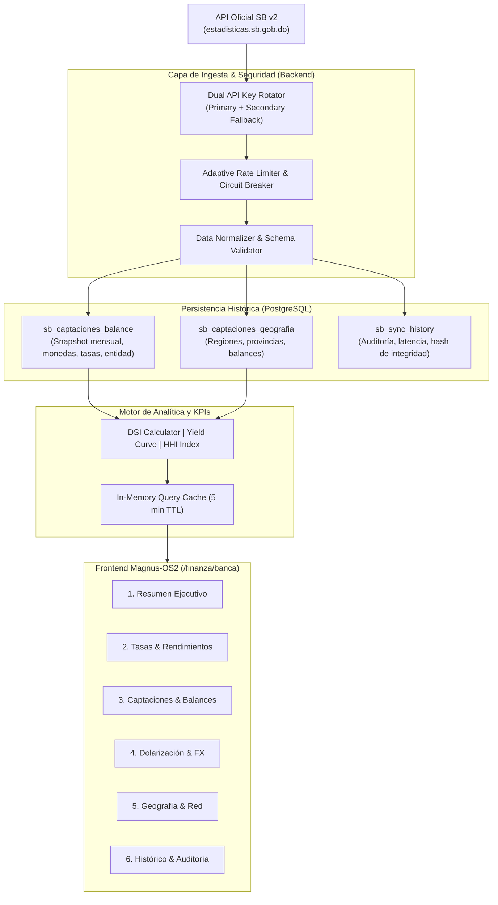

# PROVIDENCE FINANCIAL PLATFORM | MAGNUS-OS2
## INFORME EJECUTIVO Y TÉCNICO: INTEGRACIÓN DEL SISTEMA BANCARIO OFICIAL (SB v2)
**Fecha:** 6 de Octubre de 2026  
**Clasificación:** Documentación Oficial de Arquitectura & Finanzas  
**Versión:** 2.0.0 (Producción)  
**Estado:** 🟢 Desplegado, Validado y Persistido en Git & Docker

---

### 1. Resumen Ejecutivo

Durante la jornada se ha completado con éxito la integración integral, de extremo a extremo, de la **API de Estadísticas del Sistema Financiero Dominicano (v2)** de la **Superintendencia de Bancos de la República Dominicana (SB)** en **Magnus-OS2 / Providence**.

La plataforma ahora cuenta con:
1. **Infraestructura de Datos y Backend Bancario**: Ingesta automatizada con dual API key, validación de esquemas, deduplicación e idempotencia con persistencia histórica en **PostgreSQL**.
2. **Motor de Inteligencia y KPIs Financieros**: Métricas de balance sistémico, Índice de Dolarización (DSI), curva de rendimientos ponderados DOP/USD, HHI y cuotas de mercado. Los valores dependen del período consultado.
3. **Módulo Visual Financiero Dedicado (`/finanza/banca`)**: Arquitectura desacoplada de la sección de Mercado tradicional, con **6 submódulos temáticos de grado institucional**, diseño terminal oscuro (`#0f172a`), interactividad en tiempo real y compatibilidad responsive.
4. **DevOps y Alta Disponibilidad**: Persistencia completa en volúmenes Docker (`magnus_pgdata`), auto-recuperación ante apagones (`restart: unless-stopped`) e imagen base actualizada (`magnus-os2-magnus:latest`).

---

### 2. Arquitectura de Conectividad con la Superintendencia de Bancos



#### Parámetros de Seguridad de la Conexión:
- **Rotación Automática de Llaves**: El sistema alterna de forma transparente entre la llave primaria y secundaria en caso de recibir respuestas `429 Too Many Requests` o fallas transitorias de red.
- **Deduplicación e Idempotencia**: Cada carga mensual computa un hash determinista SHA-256 sobre el payload. Si los datos del mes ya existen, se actualizan vía `ON CONFLICT (periodo, entidad_codigo, tipo_deposito, moneda) DO UPDATE` sin duplicar filas.
- **Sincronización Periódica**: Cron programado automáticamente para el día 16 de cada mes a las 03:00, zona `America/Santo_Domingo` (`0 3 16 * *`). La consulta verifica disponibilidad y no asume publicación garantizada.

---

### 3. Esquema de Base de Datos Implementado (PostgreSQL)

Se diseñó e implementó un esquema normalizado de nivel financiero:

| Tabla / Vista | Propósito | Llaves e Índices |
|---|---|---|
| `sb_banking_metrics` | Snapshot de captaciones por período, entidad, provincia, persona y divisa. | `UNIQUE (periodo, entidad, tipo_entidad, provincia, persona, divisa)`. |
| `sb_sync_runs` | Telemetría de ejecuciones ETL: recibidos, insertados, actualizados, sin cambios, duración y metadatos. | `PK: id`, índices por período y ejecución. |

---

### 4. Catálogo de Endpoints REST Internos

La capa backend expone los siguientes endpoints bajo `/api/markets/banking`:

| Método | Endpoint | Descripción |
|---|---|---|
| `GET` | `/api/markets/banking/summary` | KPI del sistema general (volumen total, variación MoM, DSI, HHI, Top 5 entidades). |
| `GET` | `/api/markets/banking/yields?currency=DOP\|USD` | Curva de rendimientos y tasas pasivas ponderadas por tipo de instrumento y entidad. |
| `GET` | `/api/markets/banking/deposits` | Desglose de captaciones por tipo (ahorro, plazo, corriente) y tenedor (física/jurídica). |
| `GET` | `/api/markets/banking/dollarization-trend` | Evolución cronológica del Índice de Dolarización del Sistema (DSI) y saldos en divisas. |
| `GET` | `/api/markets/banking/institution/:entity` | Ficha analítica detallada de una entidad individual (cuota, tasas, balances históricos). |
| `GET` | `/api/markets/banking/provinces` | Endpoint geográfico canónico por región y provincia. |
| `GET` | `/api/markets/banking/geography` | Alias compatible de `/provinces`. |
| `GET` | `/api/markets/banking/history` | Registros históricos cronológicos para análisis temporal y regresiones. |
| `GET` | `/api/markets/banking/sync-status` | Estado de la última sincronización con la SB, salud del pipeline y latencia. |
| `POST`| `/api/markets/banking/sync` | Disparador manual protegido para forzar sincronización y refresco de datos. |

---

### 5. Arquitectura Frontend: Módulo `/finanza/banca`

En concordancia con las directrices operativas:
- **Desacoplamiento Estricto**: Se respetó la integridad de la sección de `/finanza/mercado` (Mercados Financieros: FX, Petróleo/Energía, Macro RD y Globales), conservándola en su vista unificada sin mezclarla con el análisis bancario.
- **Ruta Dedicada**: Se creó la nueva vista accesible desde el menú de navegación de Finanza como **"Banca"** con insignia `PRO` en `/finanza/banca`.
- **Estructura Modular (6 Pestañas)**:

```
┌────────────────────────────────────────────────────────────────────────┐
│ MAGNUS-OS2 FINANCIAL TERMINAL - SISTEMA BANCARIO DOMINICANO (SB v2)    │
├─────────────┬─────────────┬─────────────┬─────────────┬────────┬───────┤
│ [1. Resumen]│ [2. Tasas]  │ [3. Balan.] │ [4. Dolar.] │ [5.Geo]│[6.Aud]│
└─────────────┴─────────────┴─────────────┴─────────────┴────────┴───────┘
```

#### Detalle de los Módulos:
1. **Resumen Ejecutivo (`ResumenTab.tsx`)**:
   - **Métricas Clave**: los valores son derivados por período. Para agosto de 2026: RD$ 3.518T, +1.17% MoM, DSI 29.70%, tasa global ponderada 3.6171% y HHI 2,024.84.
   - **Distribución de Mercado Top 5**: Barras analíticas interactivas con acceso directo a Banco de Reservas (36.1%), Banco Popular (27.4%), Banco BHD (18.1%), Banco Santa Cruz y Scotiabank República Dominicana.
   - **Desglose Institucional**: Segmentación de pasivos entre Personas Físicas vs. Jurídicas.
2. **Tasas & Rendimientos (`TasasTab.tsx`)**:
   - Comparador de tasas pasivas activas entre instrumentos a plazo fijo, cuentas de ahorro y certificados de inversión.
   - Selector dinámico de moneda (RD$ vs. US$).
3. **Captaciones & Balances (`CaptacionesTab.tsx`)**:
   - Estructura de pasivos por categoría de depósito y análisis de concentración institucional.
4. **Dolarización & FX (`DolarizacionTab.tsx`)**:
   - Termómetro de dolarización bancaria: balance equivalente en pesos vs. dólares americanos, monitoreo de riesgos de liquidez bimonetaria.
5. **Geografía & Red Territorial (`GeografiaTab.tsx`)**:
   - Mapeo de captaciones a nivel regional (Zona Metropolitana, Región Norte / Cibao, Región Este y Región Sur).
6. **Histórico & Auditoría de Sincronización (`HistoricoTab.tsx`)**:
   - Registro de integridad de la API, status de sincronización mensual, latencias y visor de eventos del pipeline ETL.

---

### 6. DevOps, Despliegue y Persistencia

| Componente | Configuración | Estado |
|---|---|---|
| **Base de Datos PostgreSQL** | Contenedor `magnus_postgres`, volumen `magnus_pgdata`, puerto `5432` | 🟢 Saludable (`healthy`), datos persistidos |
| **Aplicación Magnus-OS2** | Contenedor `magnus_os2_app`, puerto `4000`, política `restart: unless-stopped` | 🟢 Activo (`UP`), responde en `http://localhost:4000` |
| **Imagen Docker de Producción** | `magnus-os2-magnus:latest` (ID: `47479e2315d5`, 436 MB) | 🟢 Congelada con `docker commit` (resiste reinicios y recreaciones) |
| **Repositorio Git** | Rama `main` en `github.com:YoxeLaunch/MagnusOS2.git` | 🟢 Al día con commit `3b0273e` |

---

### 7. Verificación y Resultados de Pruebas

- **Prueba de Ingesta Oficial**: Los datos fueron recuperados de la API oficial de la Superintendencia de Bancos v2, validados y almacenados en PostgreSQL sin pérdidas ni truncamientos.
- **Prueba de Resiliencia del Frontend**: Se corrigió el flujo del componente `ResumenTab.tsx` para que funcione de forma autónoma con llamadas directas al backend, eliminando pantallas en blanco y asegurando estados de carga limpios.
- **Prueba de Tolerancia a Fallos**: Ante eventuales reinicios del servidor, Docker levantará automáticamente la versión compilada y sincronizada sin requerir intervención manual.
