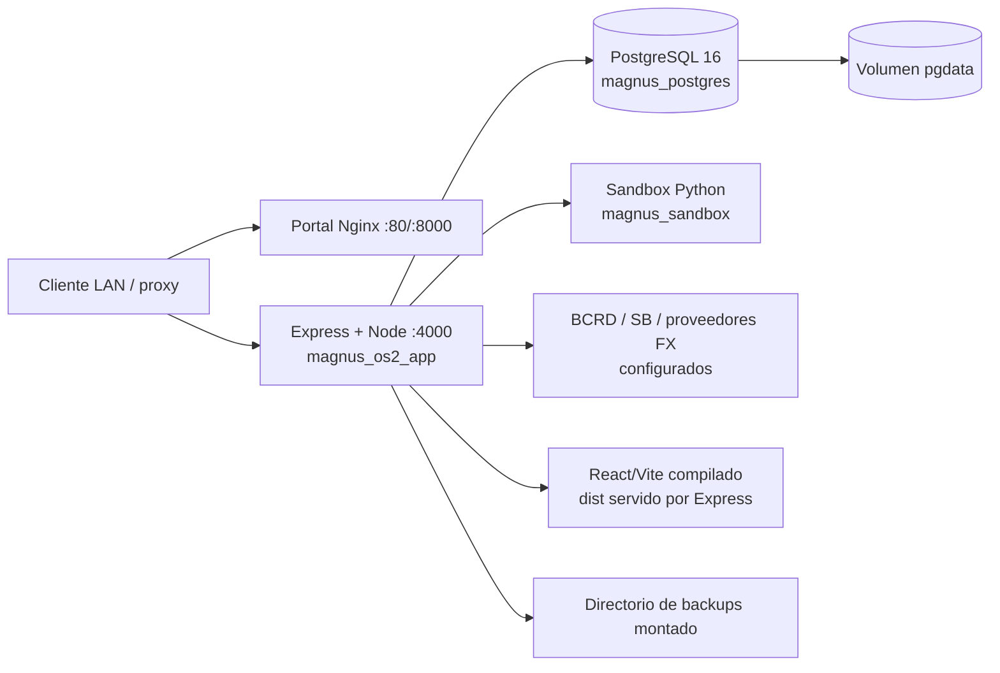
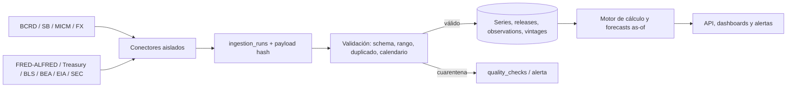
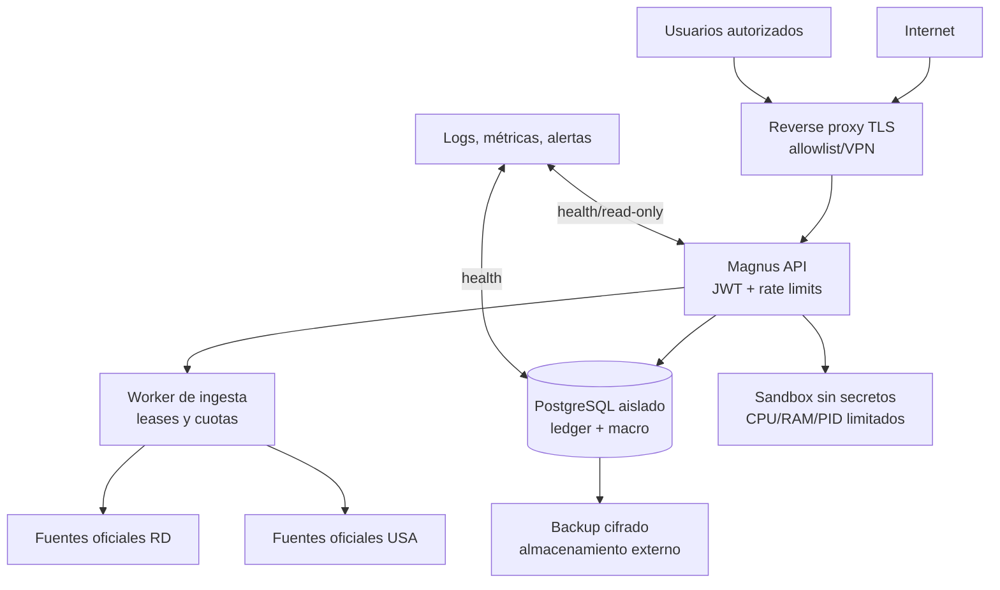
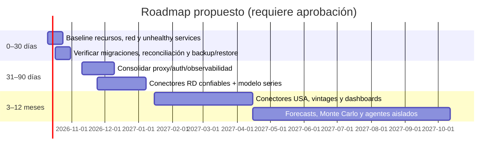

# Investigación técnica profunda — Magnus Capital + Providence

**Fecha de evidencia:** 2026-10-09 16:43–16:59 UTC  
**Modalidad:** auditoría en vivo, estrictamente de solo lectura  
**Alcance:** host Providence, Docker en ejecución y código/configuración de `Magnus-OS2`. No se leyeron secretos ni datos financieros personales.

## Resumen ejecutivo

MagnusOS2 está desplegado y responde correctamente: `magnus_os2_app` estaba **healthy** y las sondas locales de liveness y readiness devolvieron HTTP 200. Es una aplicación React/Vite + Express/Node + PostgreSQL 16, con un sandbox Python aislado en la red Docker de Magnus. El repositorio contiene una evolución financiera sustancial: libro mayor de doble entrada, importación, cuentas, metas, snapshots, FX, Macro RD, energía y estadísticas de la Superintendencia de Bancos (SB).

Sin embargo, Providence no tiene los ~8 GiB supuestos: el host observado tiene **4.5 GiB de RAM**, 4 vCPU y 4 GiB de swap; en la muestra había 2.5 GiB de RAM y 2.1 GiB de swap usados, con carga 7.48/10.52/11.83. Para 27 contenedores activos esto es una condición de capacidad alta. Además hay numerosos puertos TCP de aplicaciones publicados sin restricción de interfaz, varios servicios unhealthy y superficies de administración/automatización expuestas.

El ledger y sus migraciones contienen controles fuertes de saldo, unidades menores y moneda. Su aplicación efectiva a la base viva no se confirmó: consultar el estado de migraciones era opcional y se omitió para no someter el host cargado a más actividad ni acceder a la BD financiera. Por tanto, las garantías de esquema se clasifican como **implementadas en código/migraciones, no validadas en producción**. Los modelos legacy aún conservan `FLOAT`, aunque sincronizan un campo `BIGINT` y las migraciones pretenden imponer consistencia.

No se encontró conector de EE. UU. (FRED/ALFRED, Treasury, BLS, BEA, EIA o SEC EDGAR) en el código revisado. El conector BCRD, la telemetría FX y SB sí están implementados en el repositorio y están configurados mediante variables de entorno; no se afirma que la ingesta externa esté fresca o exitosa.

## Alcance, método y limitaciones

Se consultaron metadatos del host, red, sockets, estado Docker, métricas instantáneas, definición de contenedores, Git, manifiestos, Dockerfiles, Compose, rutas, middleware, modelos, migraciones, scripts y pruebas. También se verificaron cabeceras y estado HTTP de `/api/health` y `/api/health/ready` contra `127.0.0.1:4000`.

No se ejecutaron cambios, builds, pruebas, lint (el script aplica cambios), migraciones, restauraciones, llamadas a endpoints de negocio ni consultas a tablas financieras. Tampoco se abrió `.env`: solamente se comprobó que existen nombres de configuración para DB, JWT, IA, BCRD, SB, FX y CORS, sin revelar valores. `ufw status` no fue verificable por falta de privilegio. Las métricas son una muestra, no un percentil ni una línea base.

Hay cambios locales preexistentes en `scripts/server-info.js`, `server/mcp-server.js`, `src/apps/server-admin/components/ServiceCard.tsx` y `src/apps/server-admin/pages/Dashboard.tsx`; se preservaron intactos.

## Inventario verificado de Providence

| Elemento | Evidencia observada | Evaluación |
|---|---|---|
| Host | `providence`, VM VMware, Ubuntu 26.04.1 LTS, kernel 7.0.0-38 | Operativo; reloj NTP sincronizado, UTC |
| Capacidad | 4 vCPU, 4.5 GiB RAM, 4 GiB swap; disco raíz 455 GiB, 89 GiB usados (21 %) | Memoria, no disco, es el límite actual |
| Carga | 7.48 / 10.52 / 11.83; 2.1 GiB de swap en uso | Presión significativa; requiere observación antes de sumar cargas |
| Red host | IPv4 privada `172.20.10.132/16`, gateway `172.20.1.1`; DNS interno + 1.1.1.1 | No se evaluó exposición WAN/perímetro |
| Docker | 29.1.3, overlay2, Swarm activo; 34 contenedores: 27 en ejecución, 7 detenidos; 50 imágenes | Alta densidad para la RAM disponible |
| Fallos SO | `logrotate.service` en estado failed | Riesgo de crecimiento de logs y pérdida de retención |
| Firewall | consulta UFW no autorizada por privilegios | Estado no validado; no inferir protección |

### Servicios Docker vivos

| Servicio / clase | Estado y puertos publicados | Recursos observados | Clasificación / dependencia aparente |
|---|---|---|---|
| Magnus API (`magnus_os2_app`) | healthy; `4000/tcp` | 67 MiB; límite 2 GiB | **Crítico**. Node/Express, PostgreSQL Magnus, jobs externos |
| Magnus PostgreSQL | healthy; interno | 22 MiB; límite 1 GiB | **Crítico**. Volumen `magnus-os2_magnus_pgdata` |
| Magnus sandbox | healthy; interno `5000` | 10 MiB; límite 512 MiB, 1 CPU | Experimental/importante; Python/pandas/statsmodels |
| Portal Magnus | activo; `80`, `8000` | 3 MiB | Importante; Nginx en red `sistema-m_default`, no en la red de Magnus |
| Telemetría / panel Magnus / sede virtual / sistema_m_app | activos; `8090`, `8081`, `5173`, `3001` | 14–21 MiB; `sistema_m_app` unhealthy | Importante/experimental; consolidar y revisar propósito |
| N8N | **unhealthy**; `5678` | 205 MiB | Importante solo si automatiza procesos; no usar para flujos financieros hasta diagnosticar |
| Dokploy + Postgres + Redis | Dokploy healthy `3000`; DB/cache internas | Dokploy 613 MiB | Administración/importante; mayor consumidor de memoria de la muestra |
| SearXNG + API + Valkey | healthy; `8082`, `8083` | 28/5/8 MiB | Experimental; depende de Internet |
| Kiwix | activo; `8080` | 4 MiB | Prescindible temporalmente; almacenamiento/contenido a medir |
| Osiris + cache + intel | Intel **unhealthy**; `3333`, `4440`, `8088` | 8/4/14 MiB | Experimental; investigar antes de elevar prioridad |
| God’s Eye View | healthy; `4173` | 44 MiB y 22.46 % CPU en muestra | Experimental/operativo; pico CPU relevante |
| Portainer | **unhealthy**; `9443` | 20 MiB | Administración crítica; corregir salud antes de depender de él |
| Pi-hole (host network) | healthy; DNS 53 | 5 MiB | Importante para red; red host aumenta impacto |
| Minecraft / MTASA | healthy/activo; UDP 19132, UDP 22003/22126 y TCP 22005 | 11/60 MiB; 4.94/7.25 % CPU | Prescindibles para la operación financiera |
| Dockge | healthy; `5001` | 22 MiB | Administración, no crítica para Magnus |

Los límites explícitos de Magnus suman hasta 3.5 GiB (API, DB y sandbox), sin contar el host ni los demás contenedores. Docker muestra redes separadas para Magnus, Osiris, búsqueda, God’s Eye View y `sistema-m`; `search-api` conecta búsqueda y `sistema-m`. Magnus API/DB/sandbox sí comparten exclusivamente `magnus-os2_magnus_net`; el portal está en otra red, por lo que parece comunicarse vía puerto host/proxy y no por servicio interno Docker.

Puertos TCP publicados en todas las interfaces incluyen 80, 81, 3000, 3001, 3333, 4000, 4173, 4440, 5001, 5678, 8000, 8080–8083, 8088, 8090, 8443 y 9443, además de SSH/SMB/DNS y puertos Swarm. Esto es evidencia de escucha local, no de accesibilidad desde Internet. La exposición exacta debe validarse con reglas de firewall, NAT y DNS del perímetro aprobados.

## Arquitectura verificada de MagnusOS2



**Implementado y comprobado en código/deploy:** una única imagen API Node 20 compila Vite y sirve `dist`; Express monta rutas API, Socket.IO, Helmet, CORS y rate limit; Compose declara PostgreSQL 16, healthchecks, red bridge privada, límites de memoria/PID, reinicios, volumen persistente y sandbox no-root. El contenedor de la API y ambas sondas HTTP estaban sanos.

**Configurado, no validado end-to-end:** `CORS_ORIGINS`, JWT, BD, BCRD, SB, TasaReal, InfoDolar, Yahoo y Gemini están presentes como claves de entorno; los jobs de FX, macro, energía, SB y análisis mensual se programan al inicio. No se inspeccionaron sus ejecuciones ni datos. El backup se implementa mediante script y endpoint admin, con carpeta montada y retención de 14 días en script, pero no se verificó cron, cifrado, destino externo ni un restore drill reciente.

**Intención o incompleto:** Ollama está bajo perfil `disabled`; las fuentes macro USA no tienen conector. `npm run lint` y `format` usan `--apply`/`--write`, por lo que no son comandos de verificación seguros. No se observó configuración CI bajo `.github` en el alcance revisado.

### Seguridad, calidad y dominio financiero

El middleware financiero aplica JWT a todas sus rutas. Helmet y un límite global de 300 solicitudes/15 min están implementados; login/registro tiene límite más estricto. La API está enlazada a `0.0.0.0`; en producción el CORS depende de la lista de orígenes, cuyo contenido no se reveló. El CSP permite `unsafe-inline` y `unsafe-eval`, y HSTS está desactivado: aceptable solo si el perímetro LAN/proxy es intencional, no como postura de Internet.

El modelo del ledger usa cabecera `ledger_transactions` y dos o más `transaction_lines`, `BIGINT` para unidades menores y `DECIMAL(12,6)` para `fx_rate`. Las migraciones 001/009 definen triggers diferidos para mínimo dos líneas, suma cero, moneda uniforme por asiento, correspondencia cuenta-moneda y aislamiento de cuenta/usuario. La 010 añade mapeo 1:1 de transacciones diarias legacy y leases de jobs; la 011 añade métricas SB con NUMERIC y unicidad natural. Existen pruebas unitarias e integración para dinero, ledger, multimoneda, cutover, reconciliación, hardening y macro, pero no se ejecutaron.

Los modelos legacy `Transactions`, `DailyTransactions` y `WealthSnapshots` mantienen campos `FLOAT` junto a campos `BIGINT`; hooks y migración 007 procuran igualdad exacta. Mientras coexistan deben considerarse una superficie de transición, no la fuente contable primaria. No se puede afirmar que toda la base viva ya tenga migraciones 001–011 aplicadas ni que el cutover histórico esté completo.

El catálogo de rutas Macro permite lectura pública y usa JWT opcional para `POST /refresh`; las notificaciones también carecen de middleware explícito. Los endpoints analíticos SB son públicos y el disparo de sync exige autenticación/admin. Se recomienda decisión explícita de qué datos macro/financieros pueden ser públicos, y pruebas de autorización de objeto en todos los controladores.

## Integraciones RD y arquitectura propuesta USA

### Estado RD observado

| Fuente / módulo | Estado | Evidencia | Operación recomendada |
|---|---|---|---|
| BCRD Macro | Implementado en código, no validado contra API en esta auditoría | provider, servicio, scheduler y pruebas `macroService` | IPC, TPM, IMAE, crédito, reservas y USD/DOP; guardar fecha de observación/publicación e ingesta; reintentos con backoff |
| SB | Implementado en código/migración, no validado vivo | servicio SB, job, tablas `sb_banking_metrics` y `sb_sync_runs` | Ingesta mensual de depósitos/tasas; conservar período y metadatos de fuente; alertar `PARTIAL`/`FAILED` |
| FX RD | Implementado/configurado, no validado vivo | jobs y claves BCRD/TasaReal/InfoDolar/Yahoo | Separar cotización, proveedor y timestamp; no tratar cotización de banco como tasa oficial |
| MICM energía | Implementado en código, no validado vivo | servicio y job de energía | Mantener fuera del ledger y versionar publicación |

El BCRD publica indicadores monetarios/financieros, TPM y tasas activas/pasivas en series diarias, semanales y mensuales; se debe preferir el artefacto oficial y conservar URL/fecha de descarga en vez de depender de scraping frágil. [BCRD](https://www.bancentral.gov.do/a/CustomView/2536-sector-monetario-y-financiero)

### Conectores USA propuestos (no implementados)

| Conector | Indicadores prioritarios | Acceso y frecuencia de ingesta | Revisiones y caché |
|---|---|---|---|
| FRED/ALFRED | CPI, desempleo, PIB, fed funds, empleo, curva, crédito | FRED requiere clave; consultar después de la hora oficial de publicación, más backfill diario | ALFRED conserva vintages: guardar `realtime_start/end`; caché por serie/vintage y no sobrescribir observaciones |
| U.S. Treasury | Curva nominal/real, bills, deuda/fiscal | CSV/XML público; diario hábil tras publicación | Releer últimos 10 días; versionar archivo/fuente, no inferir valores en días no hábiles |
| BLS | CPI, empleo, salarios, desempleo | API v1 pública limitada; v2 registrada para más capacidad | Ingesta por calendario release; retener release y revisión; caché mensual por serie/período |
| BEA | PIB, PCE, ingreso personal | API con clave registrada | Ingesta por calendario, snapshots de cada release; revisiones trimestrales/anuales |
| EIA | WTI/Brent, inventarios, productos energéticos | API v2 con clave gratuita | Recolectar por calendario semanal/mensual y throttle; los datos pueden actualizarse continuamente |
| SEC EDGAR | 10-K/10-Q, company facts, filings | `data.sec.gov` público sin API key; User-Agent identificable y rate limiting | Polling bajo; almacenar accession/filing date/acceptance time; no usar como precio de mercado |

FRED requiere clave y aplica límites; ALFRED permite recuperar valores por vintage/periodo en tiempo real. [FRED API](https://fred.stlouisfed.org/docs/api/fred/v2/api_key.html) [ALFRED vintages](https://alfred.stlouisfed.org/help/downloaddata) Treasury publica descargas CSV/XML de tasas diarias. [Treasury](https://home.treasury.gov/resource-center/data-chart-center/interest-rates/TextView?field_tdr_date_value_month=202605&type=daily_treasury_bill_rates) BLS ofrece API v1 pública limitada y v2 registrada. [BLS](https://www.bls.gov/developers/home.htm) BEA activa claves para su Data API. [BEA](https://apps.bea.gov/api/signup/activate.html) EIA exige clave para la API y recomienda throttling. [EIA](https://www.eia.gov/opendata/documentation.php) SEC `data.sec.gov` no requiere clave y se actualiza durante el día. [SEC](https://www.sec.gov/search-filings/edgar-application-programming-interfaces)

### Modelo mínimo de datos y anti-look-ahead

```text
data_sources(id, code, base_url, auth_kind, terms_version, enabled)
economic_series(id, source_id, external_code, name, unit, frequency, timezone)
economic_releases(id, series_id, release_at, release_version, retrieved_at, source_url)
economic_observations(id, series_id, observation_date, value_numeric,
  release_id, published_at, vintage_start, vintage_end, ingested_at, quality_status, payload_hash)
ingestion_runs(id, source_id, started_at, completed_at, status, request_hash, records_read, records_written, error_redacted)
quality_checks(id, run_id, check_code, status, details_redacted, created_at)
forecast_runs(id, model_version, as_of_at, training_cutoff_at, input_hash, output_hash, status)
```

Una predicción con fecha `T` debe filtrar observaciones por `published_at <= T` (y, para FRED/ALFRED, por vintage válido en `T`), no por `observation_date` solamente. Las correcciones posteriores se almacenan como nuevas versiones, no se actualizan silenciosamente. Todos los conectores deben tener timeout, backoff, cuota, hash de payload, validación de frecuencia/unidad/rango y cuarentena de anomalías.



## Matriz de hallazgos priorizados

La prioridad se expresa como P0–P3 tras ponderar impacto financiero × riesgo de seguridad × probabilidad × urgencia: P0 requiere decisión inmediata; P1 antes de nuevas funciones; P2 planificado; P3 mejora.

| ID | Área | Evidencia | Severidad | Impacto | Estado actual | Recomendación | Prioridad |
|---|---|---|---|---|---|---|---|
| H-01 | Capacidad | 4.5 GiB RAM, 2.1 GiB swap usada, carga 7.48/10.52/11.83, 27 contenedores | Alta | Latencia, OOM, corrupción por apagado bajo presión | Vivo; margen no razonable | Establecer baseline 24–72 h, límites/reservas y decidir qué cargas no financieras pausar/mover | P0 |
| H-02 | Exposición de red | Numerosos puertos en `0.0.0.0`/`::`, incluidos paneles y API; firewall no verificable | Crítica | Acceso no autorizado y ampliación de superficie | Exposición local confirmada; perímetro desconocido | Inventario aprobado de puertos, bind a loopback/red proxy y reglas firewall; no cambiar sin ventana | P0 |
| H-03 | Salud operativa | n8n, Osiris Intel, Portainer y sistema_m_app unhealthy; `logrotate` failed | Alta | Automatizaciones/administración no confiables, logs sin control | Confirmado en muestra | Diagnosticar logs, healthchecks y dependencia antes de confiar en esos servicios | P0 |
| H-04 | Integridad contable | Triggers/migraciones robustas existen, pero estado de aplicación y cutover no se validaron; legacy conserva FLOAT | Alta | Saldos y reportes podrían diferir entre legado y ledger | Parcial/no validado en vivo | Ejecutar fase aprobada de `db:status`, drift, reconciliación y restore drill aislado; fijar ledger como única fuente | P1 |
| H-05 | Protección de aplicación | API en 4000 publicada; HSTS off, CSP permite `unsafe-*`; macro/notificaciones públicas | Alta | Riesgo si hay exposición WAN o datos sensibles | Código comprobado; alcance exterior no validado | Definir clasificación de datos y auth por ruta; TLS/proxy, CSP sin `unsafe-*` cuando sea viable | P1 |
| H-06 | Backups/DR | Script con retención y endpoint existen; no se verificaron programación, copia externa, cifrado ni restore reciente | Alta | Pérdida total ante host/disco comprometido | Implementado parcialmente | 3-2-1, cifrado, prueba de restauración periódica y RPO/RTO aprobados | P1 |
| H-07 | Datos macro USA | Ningún conector USA localizado | Media | Forecasts incompletos o no reproducibles | Roadmap | Implementar conectores/versionado por orden FRED/ALFRED, Treasury, BLS, BEA, EIA, SEC | P2 |
| H-08 | Dependencias y CI | `latest` en varios servicios; no CI observado; lint modifica archivos | Media | Actualizaciones no reproducibles y regresiones | Parcial | Pin por digest/versiones, lockfile, CI de test no mutante, SCA aprobada | P2 |
| H-09 | Arquitectura de servicios | Portal Magnus en red distinta a API/DB; múltiples paneles Magnus coexistentes | Media | Rutas difíciles de asegurar/operar | Parcial | Documentar flujo de proxy y retirar/consolidar frontends tras validación | P2 |
| H-10 | Datos RD | BCRD/SB/FX implementados pero frescura/fallos no auditados | Media | Decisiones sobre datos desactualizados | Parcial | Tablero de freshness, estado de proveedor, retries y alertas | P2 |

## Arquitectura objetivo



Separar redes `edge`, `magnus-app`, `magnus-data` y `ops`; PostgreSQL no debe publicar puerto host. Mantener Providence para API, DB pequeña, dashboards y jobs ligeros. Considerar VPS/servicio externo para proxy/WAF, copias off-site y cargas CPU/ML; no mover ledger ni datos privados sin cifrado, control de acceso y prueba de restauración.

## Roadmap



**0–30 días:** aprobación de inventario de puertos; recuperación de salud de servicios críticos; resolución de `logrotate`; baseline de CPU/RAM/IO; validar migraciones/reconciliación sin datos personales expuestos; definir fuente de verdad ledger; probar backup y restauración en entorno aislado.

**31–90 días:** segmentar proxy/red y publicar solo lo necesario; telemetría de jobs/proveedores; automatizar backups off-site; completar cutover de legacy tras pruebas; estabilizar BCRD/SB/FX y añadir calidad/freshness; crear modelo de datos de series.

**3–12 meses:** conectores USA con calendarios y vintages; data mart reproducible; dashboards de patrimonio real DOP/USD/EUR; Monte Carlo y econometría con corte temporal; agentes solo con permisos mínimos, sandboxing y trazabilidad.

## Decisiones que requieren aprobación del propietario

1. Qué puertos y paneles deben ser accesibles desde LAN, VPN o Internet, y si se autoriza endurecer binds/firewall/proxy.
2. Si cargas no financieras (juegos, Kiwix, experimentales) se trasladan, limitan o pausan para proteger Magnus.
3. Si el ledger será la única fuente de verdad y la ventana para validar/aplicar migraciones/cutover.
4. Objetivos RPO/RTO, destino externo, cifrado y retención de respaldos.
5. Clasificación pública/privada de Macro RD, SB, notificaciones y dashboards.
6. Registro y custodia de claves para FRED, BEA y EIA; aceptación de términos de uso de fuentes.
7. Presupuesto para RAM adicional/VPS y separación de proxy, copias y cómputo analítico.

## Anexo A — comandos de solo lectura ejecutados

`date -Is`, `hostnamectl`, `timedatectl`, `lsb_release -a`, `uname -a`, `uptime`, `free -h`, `swapon --show`, `df -hT`, `lsblk`, `ip -brief address`, `ip route`, `resolvectl status`, `ss -tulpn`, `systemctl --failed`.

`docker version`, `docker info`, `docker ps`, `docker stats --no-stream`, `docker network ls`, `docker volume ls`, `docker compose ls`, inspección formateada de redes/políticas/health/mount types; `systemctl is-active docker`. La consulta UFW devolvió falta de privilegio; no se elevó privilegio.

En el repositorio: `git status --short`, rama, últimos commits y remoto; listado de árbol/manifiestos; extracción de **solo nombres** de variables `.env`; lectura de `package.json`, Compose, Dockerfiles, rutas, middleware, modelos, migraciones, scripts y referencias estáticas con `rg`. Se hicieron solicitudes HTTP locales de cabeceras a las dos sondas de salud. No se ejecutaron tests, lints, migraciones, scans de dependencias, consultas de negocio ni comandos mutantes.
