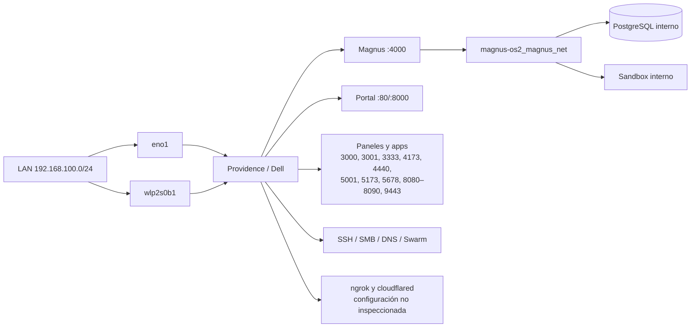
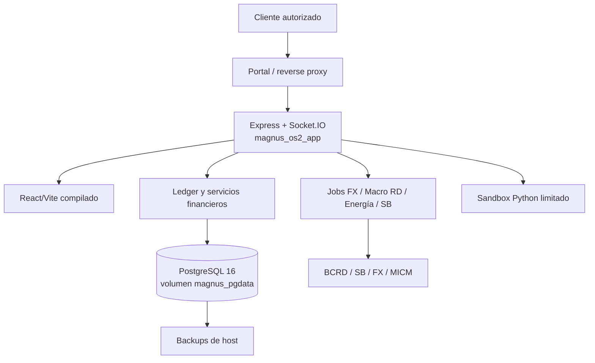
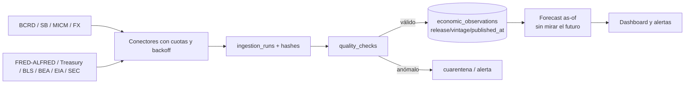
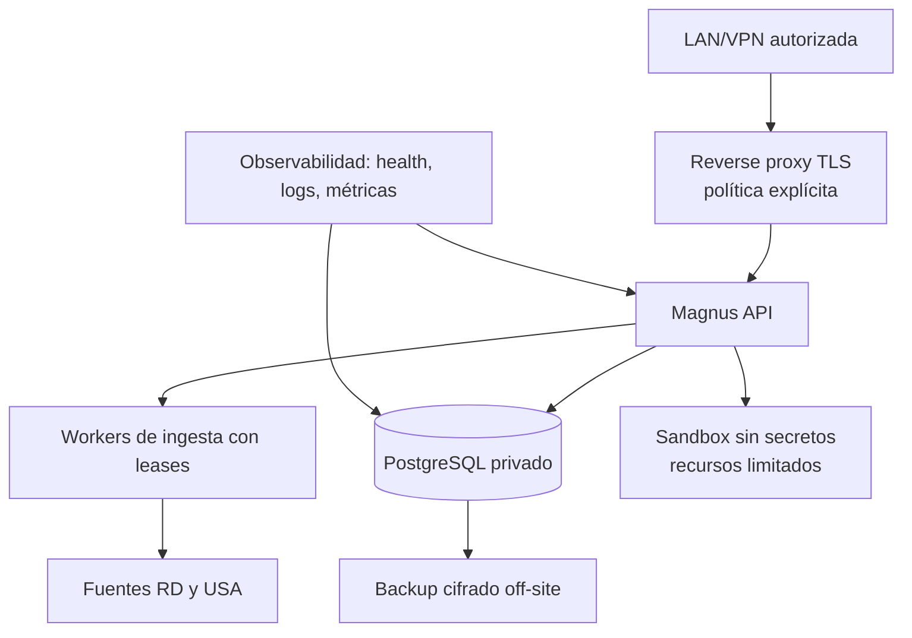
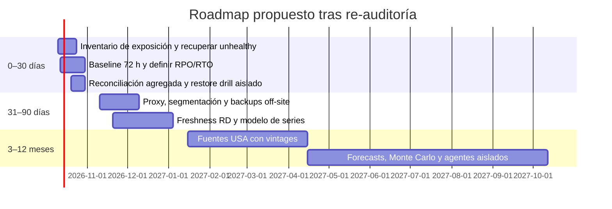

# Re-auditoría en vivo — Magnus Capital + Providence (Dell)

**Fecha de evidencia:** 2026-10-10 00:09–00:12 UTC  
**Modalidad:** solo lectura, sin secretos ni datos financieros personales  
**Complementa:** `INVESTIGACION_TECNICA_PROFUNDA_MAGNUS_CAPITAL_PROVIDENCE_2026-10-09.md`  
**Propósito:** repetir y profundizar la verificación dinámica desde el host Dell más desahogado. No reemplaza el informe anterior; ambos son snapshots de entornos físicos distintos.

## Resumen ejecutivo

La ejecución actual está sobre **Dell Latitude E6410**, no la VM VMware de la toma anterior. La Dell aporta 7.2 GiB de RAM visible para el SO frente a 4.5 GiB, y la presión instantánea bajó sustancialmente: carga 1.65/2.95/3.83 y swap de 205 MiB, frente a 7.48/10.52/11.83 y 2.1 GiB. Esto confirma que el diagnóstico de capacidad anterior estaba condicionado por la VM; en la Dell existe margen operativo mayor, aunque no ilimitado.

Magnus está operativo: `magnus_os2_app`, PostgreSQL y sandbox estaban `healthy`; liveness y readiness locales respondieron HTTP 200. Se validó en la base de producción, mediante la rutina de estado de migraciones de solo lectura, que las migraciones `000` a `011` están **aplicadas y sus checksums coinciden**. Esta es evidencia nueva y eleva la confianza de que los controles contables definidos en migraciones están desplegados.

Persisten riesgos importantes: 27 contenedores corriendo (33 totales), numerosos puertos publicados en todas las interfaces LAN/IPv6, tres contenedores `unhealthy` (`n8n_automation`, `osiris-intel`, `portainer_panel`) más `sistema_m_app`, `logrotate.service` fallido y ambas interfaces cableada/Wi‑Fi activas en la misma subred. Hay también `cloudflared` y `ngrok` en escucha local; su configuración, destinos y exposición externa no se inspeccionaron para no revelar credenciales. La superficie de acceso debe tratarse como P0.

El respaldo comprimido más reciente encontrado, de 2026-10-08 01:10 UTC, superó `gzip -t`. Esto prueba integridad del stream comprimido, **no** restaurabilidad, consistencia PostgreSQL, cobertura, cifrado ni réplica externa. Hay 10.28 GiB de imágenes Docker y 1.44 GiB de volúmenes reclamables; no se realizó limpieza.

## Alcance, controles y límites

Se consultaron metadatos del host, almacenamiento, interfaces/rutas/DNS, sockets, unidades fallidas, Docker, Compose, métricas de contenedores, redes, volúmenes, políticas de reinicio, healthchecks, estado de Git, metadatos de backups, cabeceras HTTP de healthchecks y estado de migraciones.

La verificación de migraciones ejecutó únicamente `MigrationRunner.status()` dentro del contenedor Magnus: lee `schema_migrations`, compara hashes locales y cierra la conexión. No crea tablas ni aplica migraciones. No se ejecutaron tests, lint, builds, restores, reconciliación financiera, consultas que expusieran transacciones, ni se leyeron `.env`, logs de aplicaciones o configuraciones de túneles. El estado de firewall no fue validado: el host no permitió consulta UFW sin privilegio y no se elevó privilegio.

## Comparación con la toma VM de 2026-10-09

| Dimensión | VM anterior | Dell actual | Conclusión |
|---|---:|---:|---|
| Plataforma | VMware | Dell Latitude E6410 | Son hosts/recursos físicos distintos |
| RAM visible | 4.5 GiB | 7.2 GiB | +2.7 GiB; mejora material |
| Carga | 7.48 / 10.52 / 11.83 | 1.65 / 2.95 / 3.83 | Recuperación clara en la muestra |
| Swap usado | 2.1 GiB | 205 MiB | Menos presión; vigilar durante picos |
| Disco raíz | 89/455 GiB | 89/455 GiB | Sin presión de capacidad |
| Contenedores en ejecución | 27 | 27 | Densidad sigue siendo alta |
| Magnus API / DB / sandbox | healthy | healthy | Estado consistente |
| Unhealthy | n8n, Osiris Intel, Portainer, sistema_m_app | los mismos | Problemas persistentes |
| Migraciones | no verificadas | 000–011 aplicadas/checksum OK | Riesgo contable reducido significativamente |

El contraste no prueba rendimiento sostenido. Se necesita observabilidad por al menos 24–72 horas, incluyendo periodos de scheduler, copias y uso real, antes de declarar capacidad suficiente para IA local, Monte Carlo o ingestión masiva.

## Inventario verificado de Providence en la Dell

| Componente | Evidencia | Estado / valoración |
|---|---|---|
| SO | Ubuntu 26.04.1 LTS, kernel 7.0.0-38 | NTP sincronizado; UTC |
| CPU / memoria | 4 vCPU; 7.2 GiB RAM; 4 GiB swap | 3.5 GiB disponibles en la muestra |
| Disco | HDD WDC 500 GB; raíz 455 GiB, 21 % utilizada | Espacio suficiente; rendimiento IO no medido |
| Red | `eno1` y `wlp2s0b1` activos en `192.168.100.0/24` | Doble ruta por subred; cable priorizado, Wi‑Fi sigue activo |
| Docker | 29.1.3, overlay2, Swarm activo, 33 contenedores / 50 imágenes | 27 en ejecución durante inspección |
| Fallo host | `logrotate.service` failed | Debe investigarse; puede afectar disco y diagnóstico |
| Docker recuperable | imágenes 10.28 GiB, volúmenes 1.44 GiB, cache 1.26 GiB marcados reclamables | Oportunidad, no ejecutar limpieza sin aprobación |

### Servicios y recursos instantáneos

| Servicio | Estado / puerto | Memoria observada | Clasificación |
|---|---|---:|---|
| Magnus API | healthy, `4000` | 73 MiB | Crítico |
| Magnus PostgreSQL | healthy, interno | 40 MiB | Crítico |
| Magnus sandbox | healthy, interno | 25 MiB | Importante/experimental |
| Magnus portal | activo, `80` y `8000` | 5 MiB | Importante |
| Dokploy | healthy, `3000` | 786 MiB | Administración importante; principal consumidor |
| N8N | **unhealthy**, `5678` | 289 MiB | Importante solo tras reparar healthcheck |
| SearXNG / API / Valkey | healthy, `8082` / `8083` / interno | 85/16/5 MiB | Experimental |
| Osiris Intel | **unhealthy**, `4440` | 127 MiB | Experimental; no depender |
| Portainer | **unhealthy**, `9443` | 26 MiB | Administración; reparar antes de usar como fuente de verdad |
| God’s Eye View | healthy, `4173` | 97 MiB | Experimental/operativo |
| sistema_m_app | **unhealthy**, `3001` | 33 MiB | Importante/legacy; requiere diagnóstico |
| Kiwix / Minecraft / MTASA | activos; 8080, 19132/22003/22126/22005 | 11/203/115 MiB | Prescindibles temporalmente para la plataforma financiera |

Los límites declarados por Compose para Magnus (API 2 GiB, PostgreSQL 1 GiB y sandbox 512 MiB) siguen siendo apropiados como techo, pero no son una reserva garantizada. Con cargas no financieras activas, no se debe asignar Ollama ni nuevos workers pesados sin medición sostenida.

## Red, Docker y exposición

Magnus API, PostgreSQL y sandbox comparten `magnus-os2_magnus_net`; PostgreSQL y sandbox no publican sus puertos al host. El portal Magnus pertenece a `sistema-m_default`, por lo que su integración con API no está aislada dentro de la red de Magnus. La red de búsqueda conecta su API con `sistema-m_default`; hay redes adicionales para Osiris, God’s Eye View y Dokploy/Swarm.

Los servicios TCP publicados en todas las interfaces incluyen API Magnus, portales, automatización, paneles administrativos y aplicaciones experimentales. También están expuestos SSH, SMB, DNS y puertos de Swarm; Pi-hole usa red host. `cloudflared` y `ngrok` son indicios de posibles rutas de entrada/salida, no prueba de una exposición externa efectiva. Antes de interpretar Internet exposure hay que revisar, con autorización, firewall del host, router, ACL, configuración de ambos túneles y DNS.

## MagnusOS2: arquitectura, datos y seguridad

El deploy y código previamente inspeccionados confirman React/Vite, Node/Express, PostgreSQL 16, JWT para rutas financieras, Helmet, rate limit y Compose con healthchecks/limits/restarts. En esta segunda toma se confirmó que `magnus_os2_app` responde HTTP 200 para `/api/health` y `/api/health/ready`.

### Integridad financiera: estado actualizado

| Control | Evidencia actual | Estado |
|---|---|---|
| Partida doble / mínimo de líneas / suma cero | migraciones 001 y 009 aplicadas, checksum válido | Verificado como esquema desplegado |
| Moneda de cuenta/línea y aislamiento por usuario | migración 009 aplicada, checksum válido | Verificado como esquema desplegado |
| Unidades menores y consistencia legacy | migración 007 aplicada, checksum válido | Verificado como esquema desplegado; legacy `FLOAT` aún coexiste |
| Mapeo legacy diario a ledger / leases jobs | migración 010 aplicada, checksum válido | Verificado como esquema desplegado |
| Métricas SB con NUMERIC/unicidad | migración 011 aplicada, checksum válido | Verificado como esquema desplegado |
| Saldos reales, corte histórico y reconciliación | no ejecutado para no extraer datos financieros | No validado en esta fase |

La verificación de migraciones elimina la incertidumbre principal del informe anterior sobre despliegue de invariantes. No sustituye una reconciliación: no se comprobó si los datos históricos están completamente mapeados, si los saldos coinciden ni si cada consumidor usa exclusivamente el ledger. Esas acciones requieren una fase autorizada, con reporte agregado y sin datos personales.

### Integraciones económicas

Los módulos BCRD, Superintendencia de Bancos, FX y energía RD permanecen implementados/configurados según la auditoría anterior. No se invocaron proveedores ni se verificó frescura de observaciones. No se localizaron conectores USA implementados. La arquitectura recomendada se mantiene: conectores separados y versionados para FRED/ALFRED, Treasury, BLS, BEA, EIA y SEC, con fecha de observación, fecha de publicación, fecha de ingesta, versión/vintage, hash y estado de calidad.

Para backtests y pronósticos, toda serie deberá filtrarse por `published_at <= fecha_de_corte`; en ALFRED además por el vintage que era visible en ese momento. El modelo mínimo propuesto sigue siendo `data_sources`, `economic_series`, `economic_releases`, `economic_observations`, `ingestion_runs`, `quality_checks` y `forecast_runs`.

## Backup y recuperación

Se encontraron backups Magnus entre 2026-09-27 y 2026-10-08; el más reciente comprimido identificado pasó la comprobación de formato `gzip -t`. Existen scripts de backup/restore y carpeta de backups montada en el contenedor, pero esta auditoría no verificó cron, permisos, retención efectiva, cifrado, copia off-site ni restauración. El último artefacto encontrado está aproximadamente dos días antes de la evidencia; esto no confirma que el RPO sea aceptable.

Prioridad de respaldo: (1) PostgreSQL `magnus_pgdata` y dumps consistentes; (2) configuración/Compose y secretos preservados en gestor seguro; (3) datos operativos de n8n/Dokploy/Portainer si son necesarios; (4) configuraciones Pi-hole y proxies/túneles; (5) contenido Kiwix/juegos solo si tiene valor propio. Mantener al menos una copia cifrada fuera de este host.

## Matriz de hallazgos

| ID | Área | Evidencia | Severidad | Impacto | Estado actual | Recomendación | Prioridad |
|---|---|---|---|---|---|---|---|
| D-01 | Exposición | Puertos de API, paneles, SMB, DNS y Swarm en `0.0.0.0`/IPv6; túneles detectados | Crítica | Acceso no autorizado si la LAN, router o túneles lo permiten | Confirmado localmente; perímetro no validado | Inventario/allowlist, bind interno y firewall/proxy aprobados; auditar túneles | P0 |
| D-02 | Salud operativa | n8n, Osiris Intel, Portainer y sistema_m_app unhealthy; `logrotate` failed | Alta | Automatización, administración y forense no confiables | Persistente entre ambas tomas | Diagnóstico de healthchecks y logs redactados; corregir bajo ventana aprobada | P0 |
| D-03 | Capacidad | 27 contenedores, 4 vCPU; Dell mejora RAM/carga pero Dokploy/n8n/juegos consumen memoria | Alta | Degradación bajo picos, backup o jobs | Mejorado, no probado sostenidamente | Métricas 24–72 h y presupuestos CPU/RAM; posponer IA pesada | P1 |
| D-04 | Recuperación | Gzip de último dump OK; no hay evidencia de restore/off-site/cifrado ni frecuencia diaria reciente | Alta | Pérdida de datos y RTO no conocido | Parcialmente validado | Definir RPO/RTO, copia cifrada externa y drill aislado | P1 |
| D-05 | Redundancia | Ethernet y Wi‑Fi activos en misma LAN | Media | Superficie y rutas de administración adicionales | Confirmado | Decidir interfaz primaria y política para la secundaria; no cambiar sin aprobación | P2 |
| D-06 | Integridad ledger | Todas las migraciones 000–011 aplicadas y hashes válidos; reconciliación no ejecutada | Media | Riesgo residual de datos/cutover, no de ausencia de esquema | Mejorado y parcialmente validado | Fase de reconciliación agregada, drift y prueba de restauración | P1 |
| D-07 | Datos macro USA | No hay conectores implementados | Media | Modelos sin cobertura/reproducibilidad USA | Roadmap | Implementar fuentes con vintages, releases y validación | P2 |
| D-08 | Higiene Docker | 10.28 GiB imágenes y 1.44 GiB volúmenes reclamables | Baja | Consumo de disco futuro; no urgente (21 % usado) | Oportunidad | Clasificar activos antes de cualquier prune; eliminar solo con aprobación | P3 |

La prioridad combina impacto financiero, riesgo de seguridad, probabilidad y urgencia: P0 bloquea la ampliación/exposición; P1 debe cerrarse antes de sumar funciones financieras críticas; P2 planifica resiliencia; P3 optimiza sin urgencia.

## Arquitectura objetivo y roadmap

## Decisiones que requieren aprobación

1. Política explícita de acceso para cada puerto, SMB, Swarm, Dockge, Dokploy, Portainer, N8N y túneles cloudflared/ngrok.
2. Si Wi‑Fi debe permanecer activo como ruta administrativa/contingencia o quedar restringido.
3. Qué cargas no financieras se limitan, trasladan o pausan ante picos.
4. RPO/RTO, cifrado, destino off-site y autorización para un restore drill aislado.
5. Autorización para diagnosticar y corregir los cuatro contenedores unhealthy y `logrotate`.
6. Alcance de una fase de reconciliación contable agregada y verificación de cutover legacy.
7. Orden y credenciales de las fuentes macro USA.

## Anexo — comandos de evidencia

Se ejecutaron solo consultas/validaciones no mutantes: inventario del SO, memoria, discos, red, DNS, sockets y unidades fallidas; `docker version/info/ps/stats/network/volume/compose/system df/inspect`; metadatos de Git y archivos de backup; `gzip -t` contra el último dump comprimido; cabeceras HTTP de `/api/health` y `/api/health/ready`; y `MigrationRunner.status()` dentro del contenedor para leer el estado/checksum de migraciones.

No se ejecutaron `compose up/down`, restart/stop, prune, pull, build, instalaciones, cambios Git, migraciones, restauraciones, pruebas, linters que escriben, queries de datos financieros, ni lectura de secretos o contenido `.env`.
